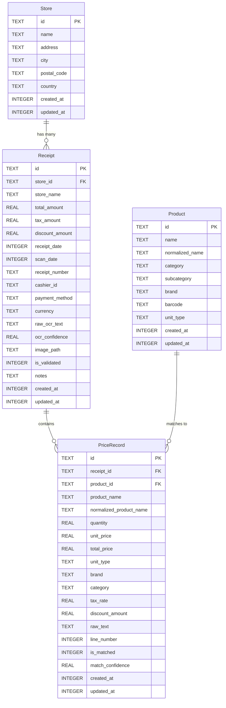
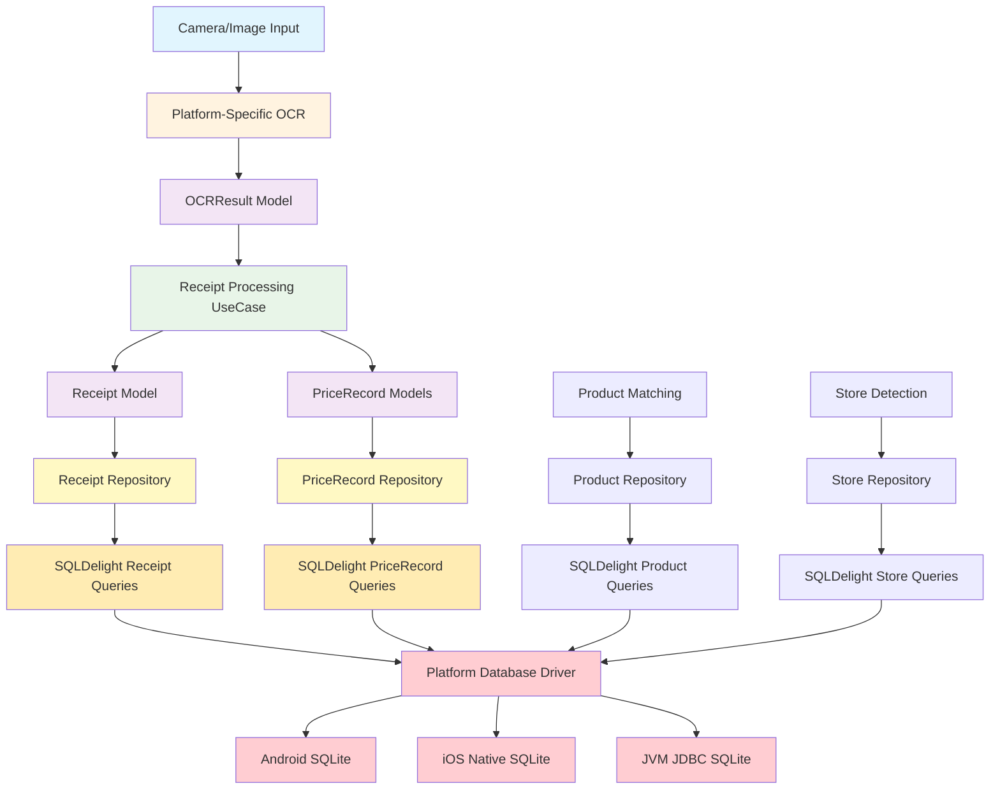
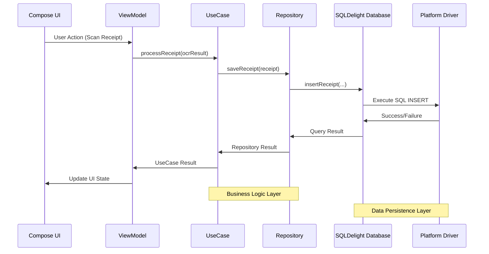
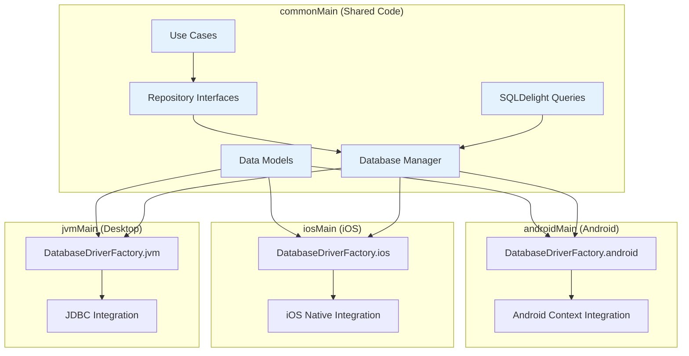
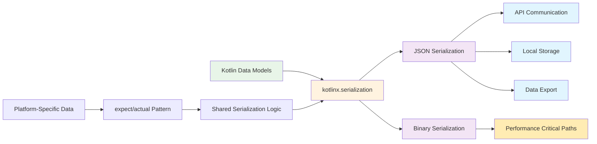
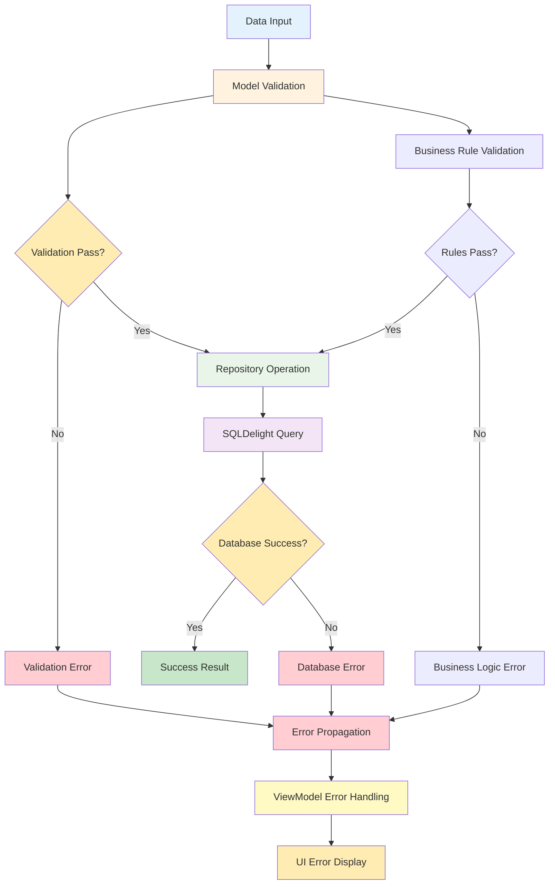
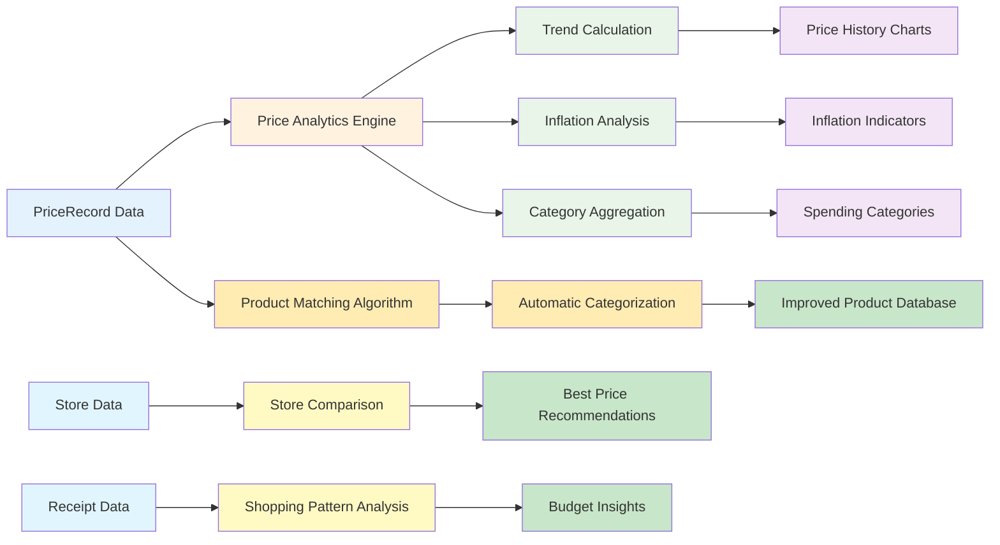

# System Data Flow and Interaction Diagrams

## Phase 1 Foundation - Data Architecture

### Database Schema Relationships

### Data Flow Through Multiplatform Architecture

### Repository Pattern Implementation Flow

### Multiplatform Code Organization

### Data Serialization Flow

### Error Handling and Validation Chain

### Analytics Data Pipeline

## Key Data Flow Patterns

### 1. Receipt Processing Pipeline

1. **Image Capture** → Platform-specific camera service
2. **OCR Processing** → Platform-specific OCR service (Vision/ML Kit)
3. **Data Extraction** → OCRResult model creation
4. **Receipt Parsing** → Receipt and PriceRecord model creation
5. **Store Matching** → Store identification and linking
6. **Product Matching** → Product identification and categorization
7. **Database Storage** → SQLDelight persistence
8. **UI Update** → ViewModel state management

### 2. Product Matching Workflow

1. **Raw Product Name** → From OCR text extraction
2. **Text Normalization** → Remove special chars, normalize case
3. **Fuzzy Matching** → Compare against existing products
4. **Confidence Scoring** → Calculate match probability
5. **Manual Review** → User validation for low confidence
6. **Product Creation** → Create new product if no match
7. **Price History** → Link to historical price data

### 3. Analytics Data Processing

1. **Raw Purchase Data** → PriceRecord entries
2. **Data Aggregation** → Group by product, category, time period
3. **Trend Analysis** → Calculate price changes over time
4. **Statistical Analysis** → Mean, median, variance calculations
5. **Visualization Data** → Format for chart components
6. **Insight Generation** → Identify significant trends
7. **Report Creation** → Generate user-friendly summaries

## Database Query Performance Patterns

### Optimized Query Strategies

1. **Indexed Lookups**: All foreign keys and search fields indexed
2. **Batch Operations**: Bulk inserts for receipt line items
3. **Selective Queries**: Only fetch required columns
4. **Aggregation Queries**: Database-level calculations for analytics
5. **Pagination Support**: Limit/offset for large result sets

### Caching Strategy

1. **Repository Level**: Cache frequently accessed data
2. **ViewModel Level**: Maintain UI state consistency
3. **Database Level**: SQLDelight query result caching
4. **Image Cache**: Store receipt images efficiently

This data flow architecture ensures:

- **Type Safety**: SQLDelight generates type-safe queries
- **Performance**: Optimized database schemas and queries
- **Consistency**: Same data model across all platforms
- **Scalability**: Support for large datasets and complex analytics
- **Maintainability**: Clear separation of concerns and data flow
