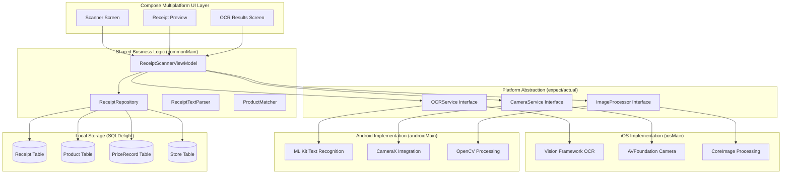
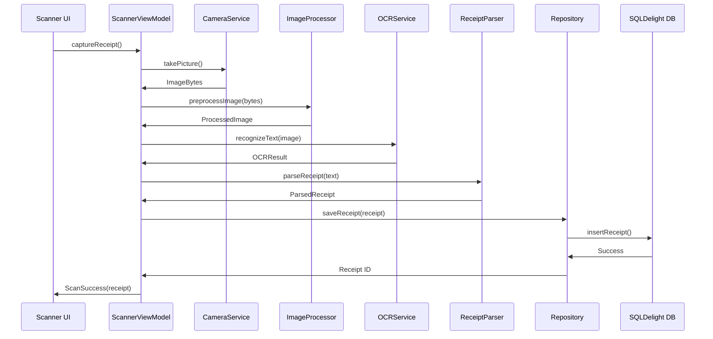

# AllesTeurer Phase 2 - Technical Design Document

## Phase 2: Platform-Specific OCR Implementation

**Generated**: September 22, 2025  
**Design Phase**: Phase 2 - Platform-Specific Implementation  
**Confidence Score**: 92% (High - Comprehensive Implementation Strategy)

## 1. Architecture Overview

### 1.1 High-Level Architecture



### 1.2 Data Flow Architecture



## 2. Component Design

### 2.1 OCR Service Interface (Expect/Actual Pattern)

#### 2.1.1 Shared Interface Definition

**File**: `composeApp/src/commonMain/kotlin/domain/ocr/OCRService.kt`

```kotlin
// Shared interface that platform-specific implementations will provide
expect class OCRService {
    suspend fun recognizeText(imageBytes: ByteArray): Result<OCRResult>
    suspend fun recognizeReceiptText(imageBytes: ByteArray): Result<ReceiptOCRResult>
    fun isAvailable(): Boolean
    fun getSupportedLanguages(): List<String>
}

// OCR configuration for German receipt processing
data class OCRConfiguration(
    val language: String = "de",
    val recognitionLevel: RecognitionLevel = RecognitionLevel.ACCURATE,
    val customWords: List<String> = emptyList(),
    val enableReceiptOptimization: Boolean = true
)

enum class RecognitionLevel {
    FAST,      // Quick recognition, lower accuracy
    ACCURATE,  // Balanced speed/accuracy
    PRECISE    // Maximum accuracy, slower processing
}

// Raw OCR result from platform-specific implementations
data class OCRResult(
    val text: String,
    val confidence: Float,
    val boundingBoxes: List<TextBoundingBox>,
    val language: String,
    val processingTimeMs: Long,
    val errors: List<OCRError> = emptyList()
)

// Receipt-specific OCR result with parsed structure
data class ReceiptOCRResult(
    val rawText: String,
    val storeName: String?,
    val receiptDate: String?,
    val totalAmount: String?,
    val items: List<ReceiptLineItem>,
    val confidence: Float,
    val parseErrors: List<ReceiptParseError> = emptyList()
)

data class TextBoundingBox(
    val text: String,
    val x: Float,
    val y: Float,
    val width: Float,
    val height: Float,
    val confidence: Float
)

data class ReceiptLineItem(
    val text: String,
    val extractedName: String?,
    val extractedPrice: String?,
    val confidence: Float,
    val boundingBox: TextBoundingBox
)

sealed class OCRError(val message: String, val cause: Throwable? = null) {
    class NetworkError(message: String, cause: Throwable? = null) : OCRError(message, cause)
    class ProcessingError(message: String, cause: Throwable? = null) : OCRError(message, cause)
    class UnsupportedFormat(message: String) : OCRError(message)
    class InsufficientQuality(message: String) : OCRError(message)
    class PermissionDenied(message: String) : OCRError(message)
}

sealed class ReceiptParseError(val message: String) {
    class InvalidFormat(message: String) : ReceiptParseError(message)
    class MissingRequiredField(val field: String, message: String) : ReceiptParseError(message)
    class AmbiguousData(val field: String, message: String) : ReceiptParseError(message)
}
```

#### 2.1.2 iOS Implementation (Vision Framework)

**File**: `composeApp/src/iosMain/kotlin/platform/ocr/OCRService.kt`

```kotlin
import platform.Vision.*
import platform.Foundation.*
import platform.CoreGraphics.*
import platform.UIKit.*

actual class OCRService {
    private val configuration = OCRConfiguration()

    actual suspend fun recognizeText(imageBytes: ByteArray): Result<OCRResult> {
        return try {
            val nsData = imageBytes.toNSData()
            val image = UIImage.imageWithData(nsData) ?: return Result.failure(
                OCRError.ProcessingError("Failed to create UIImage from bytes")
            )

            performVisionTextRecognition(image)
        } catch (e: Exception) {
            Result.failure(OCRError.ProcessingError("iOS OCR failed", e))
        }
    }

    actual suspend fun recognizeReceiptText(imageBytes: ByteArray): Result<ReceiptOCRResult> {
        return recognizeText(imageBytes).fold(
            onSuccess = { ocrResult ->
                val receiptParser = IOSReceiptParser()
                Result.success(receiptParser.parseReceiptText(ocrResult))
            },
            onFailure = { error ->
                Result.failure(error)
            }
        )
    }

    private suspend fun performVisionTextRecognition(image: UIImage): Result<OCRResult> {
        // Vision Framework implementation details
        val request = VNRecognizeTextRequest()
        request.recognitionLanguages = listOf("de-DE", "en-US")
        request.recognitionLevel = VNRequestTextRecognitionLevel.VNRequestTextRecognitionLevelAccurate
        request.usesLanguageCorrection = true

        // Configure for receipt-specific processing
        request.customWords = listOf(
            "Summe", "Gesamt", "Total", "Betrag",
            "MwSt", "Steuer", "Datum", "Uhrzeit"
        )

        return suspendCoroutine { continuation ->
            val handler = VNImageRequestHandler(cgImage = image.CGImage, options = mapOf<Any?, Any?>())

            try {
                handler.performRequests(listOf(request)) { error ->
                    if (error != null) {
                        continuation.resume(Result.failure(OCRError.ProcessingError(error.localizedDescription)))
                        return@performRequests
                    }

                    val observations = request.results as List<VNRecognizedTextObservation>
                    val ocrResult = processVisionResults(observations)
                    continuation.resume(Result.success(ocrResult))
                }
            } catch (e: Exception) {
                continuation.resume(Result.failure(OCRError.ProcessingError("Vision processing failed", e)))
            }
        }
    }

    actual fun isAvailable(): Boolean = true

    actual fun getSupportedLanguages(): List<String> = listOf("de", "en", "fr", "es")
}
```

#### 2.1.3 Android Implementation (ML Kit)

**File**: `composeApp/src/androidMain/kotlin/platform/ocr/OCRService.kt`

```kotlin
import com.google.mlkit.vision.text.TextRecognition
import com.google.mlkit.vision.text.latin.TextRecognizerOptions
import com.google.mlkit.vision.common.InputImage
import android.graphics.BitmapFactory

actual class OCRService(private val context: Context) {
    private val recognizer = TextRecognition.getClient(
        TextRecognizerOptions.Builder()
            .setExecutor(ContextCompat.getMainExecutor(context))
            .build()
    )

    actual suspend fun recognizeText(imageBytes: ByteArray): Result<OCRResult> {
        return try {
            val bitmap = BitmapFactory.decodeByteArray(imageBytes, 0, imageBytes.size)
                ?: return Result.failure(OCRError.ProcessingError("Failed to decode image bytes"))

            val inputImage = InputImage.fromBitmap(bitmap, 0)

            suspendCoroutine { continuation ->
                recognizer.process(inputImage)
                    .addOnSuccessListener { visionText ->
                        val result = processMLKitResults(visionText)
                        continuation.resume(Result.success(result))
                    }
                    .addOnFailureListener { exception ->
                        continuation.resume(Result.failure(OCRError.ProcessingError("ML Kit processing failed", exception)))
                    }
            }
        } catch (e: Exception) {
            Result.failure(OCRError.ProcessingError("Android OCR failed", e))
        }
    }

    actual suspend fun recognizeReceiptText(imageBytes: ByteArray): Result<ReceiptOCRResult> {
        return recognizeText(imageBytes).fold(
            onSuccess = { ocrResult ->
                val receiptParser = AndroidReceiptParser()
                Result.success(receiptParser.parseReceiptText(ocrResult))
            },
            onFailure = { error ->
                Result.failure(error)
            }
        )
    }

    actual fun isAvailable(): Boolean = true

    actual fun getSupportedLanguages(): List<String> = listOf("de", "en", "fr", "es")
}
```

### 2.2 Camera Service Interface

#### 2.2.1 Shared Camera Interface

**File**: `composeApp/src/commonMain/kotlin/domain/camera/CameraService.kt`

```kotlin
expect class CameraService {
    suspend fun captureImage(): Result<ImageCaptureResult>
    suspend fun requestPermissions(): Result<PermissionStatus>
    fun isPermissionGranted(): Boolean
    fun isAvailable(): Boolean
}

data class ImageCaptureResult(
    val imageBytes: ByteArray,
    val width: Int,
    val height: Int,
    val format: ImageFormat,
    val metadata: ImageMetadata
)

data class ImageMetadata(
    val timestamp: Long,
    val orientation: ImageOrientation,
    val quality: Float,
    val fileSize: Int
)

enum class ImageFormat {
    JPEG, PNG, HEIC, WEBP
}

enum class ImageOrientation(val degrees: Int) {
    PORTRAIT(0),
    LANDSCAPE_LEFT(90),
    PORTRAIT_UPSIDE_DOWN(180),
    LANDSCAPE_RIGHT(270)
}

enum class PermissionStatus {
    GRANTED, DENIED, NOT_REQUESTED, RESTRICTED
}

sealed class CameraError(val message: String, val cause: Throwable? = null) {
    class PermissionDenied(message: String) : CameraError(message)
    class CameraUnavailable(message: String) : CameraError(message)
    class CaptureError(message: String, cause: Throwable? = null) : CameraError(message, cause)
    class ConfigurationError(message: String) : CameraError(message)
}
```

### 2.3 Image Processing Interface

#### 2.3.1 Shared Image Processing

**File**: `composeApp/src/commonMain/kotlin/domain/image/ImageProcessor.kt`

```kotlin
expect class ImageProcessor {
    suspend fun preprocessForOCR(imageBytes: ByteArray): Result<ByteArray>
    suspend fun enhanceContrast(imageBytes: ByteArray, factor: Float = 1.5f): Result<ByteArray>
    suspend fun correctPerspective(imageBytes: ByteArray): Result<ByteArray>
    suspend fun resizeForOptimalOCR(imageBytes: ByteArray): Result<ByteArray>
}

data class ImageProcessingConfig(
    val targetWidth: Int = 1024,
    val targetHeight: Int = 1024,
    val contrastFactor: Float = 1.5f,
    val enablePerspectiveCorrection: Boolean = true,
    val enableNoiseReduction: Boolean = true,
    val compressionQuality: Float = 0.9f
)
```

### 2.4 Receipt Parsing Logic (Shared)

#### 2.4.1 German Receipt Parser

**File**: `composeApp/src/commonMain/kotlin/domain/parsing/GermanReceiptParser.kt`

```kotlin
class GermanReceiptParser {
    private val storePatterRegex = listOf(
        Regex("""^([A-Z][a-zA-ZäöüÄÖÜ\s&-]{2,30})"""),  // Store name at top
        Regex("""(REWE|EDEKA|ALDI|LIDL|PENNY|NETTO)""", RegexOption.IGNORE_CASE),
        Regex("""([A-Z][a-zA-ZäöüÄÖÜ\s&-]{2,20})\s*GmbH""", RegexOption.IGNORE_CASE)
    )

    private val totalAmountRegex = listOf(
        Regex("""(?:SUMME|GESAMT|TOTAL|BETRAG)\s*:?\s*€?\s*(\d+[,.]?\d{0,2})\s*€?""", RegexOption.IGNORE_CASE),
        Regex("""(\d+[,.]?\d{2})\s*€?\s*$"""),  // Amount at end of line
        Regex("""€\s*(\d+[,.]?\d{2})""")        // € prefix
    )

    private val dateTimeRegex = listOf(
        Regex("""(\d{1,2})[.-](\d{1,2})[.-](\d{4})"""),           // DD.MM.YYYY or DD-MM-YYYY
        Regex("""(\d{4})[.-](\d{1,2})[.-](\d{1,2})"""),           // YYYY.MM.DD or YYYY-MM-DD
        Regex("""(\d{1,2}):(\d{2}):(\d{2})""")                    // HH:MM:SS
    )

    private val itemLineRegex = listOf(
        Regex("""^([A-Za-zäöüÄÖÜ\s&-]{3,40})\s+(\d+[,.]?\d{0,2})\s*€?$"""),
        Regex("""^(\d+)\s+([A-Za-zäöüÄÖÜ\s&-]{3,40})\s+(\d+[,.]?\d{0,2})\s*€?$"""),
        Regex("""^([A-Za-zäöüÄÖÜ\s&-]{3,40})\s+€?\s*(\d+[,.]?\d{0,2})$""")
    )

    fun parseReceiptText(ocrResult: OCRResult): ReceiptOCRResult {
        val lines = ocrResult.text.lines().filter { it.trim().isNotEmpty() }

        val storeName = extractStoreName(lines)
        val totalAmount = extractTotalAmount(lines)
        val receiptDate = extractDate(lines)
        val items = extractItems(lines, ocrResult.boundingBoxes)

        val parseErrors = validateParsedData(storeName, totalAmount, receiptDate, items)

        return ReceiptOCRResult(
            rawText = ocrResult.text,
            storeName = storeName,
            receiptDate = receiptDate,
            totalAmount = totalAmount,
            items = items,
            confidence = calculateOverallConfidence(ocrResult.confidence, parseErrors),
            parseErrors = parseErrors
        )
    }

    private fun extractStoreName(lines: List<String>): String? {
        // Try to find store name in first 5 lines
        for (i in 0..minOf(4, lines.size - 1)) {
            val line = lines[i].trim()
            for (pattern in storePatterRegex) {
                val match = pattern.find(line)
                if (match != null) {
                    return match.groupValues[1].trim()
                }
            }
        }
        return null
    }

    private fun extractTotalAmount(lines: List<String>): String? {
        // Look for total amount, typically in last third of receipt
        val startIndex = maxOf(0, lines.size - (lines.size / 3))
        for (i in startIndex until lines.size) {
            val line = lines[i].trim()
            for (pattern in totalAmountRegex) {
                val match = pattern.find(line)
                if (match != null) {
                    return match.groupValues[1].replace(',', '.')
                }
            }
        }
        return null
    }

    private fun extractDate(lines: List<String>): String? {
        for (line in lines) {
            for (pattern in dateTimeRegex) {
                val match = pattern.find(line)
                if (match != null) {
                    return when (match.groupValues.size) {
                        4 -> "${match.groupValues[1]}.${match.groupValues[2]}.${match.groupValues[3]}"
                        else -> match.value
                    }
                }
            }
        }
        return null
    }

    private fun extractItems(lines: List<String>, boundingBoxes: List<TextBoundingBox>): List<ReceiptLineItem> {
        val items = mutableListOf<ReceiptLineItem>()

        for (line in lines) {
            for (pattern in itemLineRegex) {
                val match = pattern.find(line)
                if (match != null) {
                    val boundingBox = findBoundingBoxForText(line, boundingBoxes)
                    items.add(
                        ReceiptLineItem(
                            text = line,
                            extractedName = match.groupValues[1].trim(),
                            extractedPrice = match.groupValues.getOrNull(2)?.replace(',', '.'),
                            confidence = boundingBox?.confidence ?: 0.5f,
                            boundingBox = boundingBox ?: TextBoundingBox(line, 0f, 0f, 0f, 0f, 0.5f)
                        )
                    )
                }
            }
        }

        return items
    }

    private fun findBoundingBoxForText(text: String, boundingBoxes: List<TextBoundingBox>): TextBoundingBox? {
        return boundingBoxes.find { box ->
            box.text.contains(text, ignoreCase = true) || text.contains(box.text, ignoreCase = true)
        }
    }

    private fun validateParsedData(
        storeName: String?,
        totalAmount: String?,
        receiptDate: String?,
        items: List<ReceiptLineItem>
    ): List<ReceiptParseError> {
        val errors = mutableListOf<ReceiptParseError>()

        if (storeName.isNullOrBlank()) {
            errors.add(ReceiptParseError.MissingRequiredField("storeName", "Store name could not be extracted"))
        }

        if (totalAmount.isNullOrBlank()) {
            errors.add(ReceiptParseError.MissingRequiredField("totalAmount", "Total amount could not be extracted"))
        } else {
            try {
                totalAmount.toFloat()
            } catch (e: NumberFormatException) {
                errors.add(ReceiptParseError.InvalidFormat("Total amount is not a valid number: $totalAmount"))
            }
        }

        if (receiptDate.isNullOrBlank()) {
            errors.add(ReceiptParseError.MissingRequiredField("receiptDate", "Receipt date could not be extracted"))
        }

        if (items.isEmpty()) {
            errors.add(ReceiptParseError.MissingRequiredField("items", "No items could be extracted from receipt"))
        }

        return errors
    }

    private fun calculateOverallConfidence(ocrConfidence: Float, parseErrors: List<ReceiptParseError>): Float {
        val errorPenalty = parseErrors.size * 0.15f  // Reduce confidence by 15% per error
        return maxOf(0.1f, ocrConfidence - errorPenalty)
    }
}
```

## 3. Data Models and Interfaces

### 3.1 Repository Interface Updates

**File**: `composeApp/src/commonMain/kotlin/domain/repository/ReceiptRepository.kt`

```kotlin
interface ReceiptRepository {
    suspend fun saveReceipt(receipt: Receipt): Result<String>
    suspend fun getReceipt(id: String): Result<Receipt?>
    suspend fun getAllReceipts(): Result<List<Receipt>>
    suspend fun deleteReceipt(id: String): Result<Unit>
    suspend fun searchReceipts(query: String): Result<List<Receipt>>

    // OCR-specific operations
    suspend fun saveOCRResult(ocrResult: OCRResult, receiptId: String): Result<Unit>
    suspend fun getOCRResult(receiptId: String): Result<OCRResult?>
    suspend fun updateReceiptFromOCR(receiptId: String, ocrResult: ReceiptOCRResult): Result<Unit>
}
```

### 3.2 ViewModel Design

**File**: `composeApp/src/commonMain/kotlin/presentation/scanner/ReceiptScannerViewModel.kt`

```kotlin
class ReceiptScannerViewModel(
    private val ocrService: OCRService,
    private val cameraService: CameraService,
    private val imageProcessor: ImageProcessor,
    private val receiptRepository: ReceiptRepository
) : ViewModel() {

    private val _scanState = MutableStateFlow<ScanState>(ScanState.Idle)
    val scanState = _scanState.asStateFlow()

    private val _cameraPermissionState = MutableStateFlow<PermissionStatus>(PermissionStatus.NOT_REQUESTED)
    val cameraPermissionState = _cameraPermissionState.asStateFlow()

    private val _lastScannedReceipt = MutableStateFlow<Receipt?>(null)
    val lastScannedReceipt = _lastScannedReceipt.asStateFlow()

    sealed class ScanState {
        object Idle : ScanState()
        object RequestingPermission : ScanState()
        object CapturingImage : ScanState()
        object ProcessingImage : ScanState()
        object ProcessingOCR : ScanState()
        object ParsingReceipt : ScanState()
        object SavingToDatabase : ScanState()
        data class Success(val receipt: Receipt) : ScanState()
        data class Error(val message: String, val cause: Throwable? = null) : ScanState()
    }

    suspend fun scanReceipt() {
        try {
            _scanState.value = ScanState.RequestingPermission

            // Check camera permission
            if (!cameraService.isPermissionGranted()) {
                val permissionResult = cameraService.requestPermissions()
                _cameraPermissionState.value = permissionResult.getOrElse { PermissionStatus.DENIED }

                if (permissionResult.getOrElse { PermissionStatus.DENIED } != PermissionStatus.GRANTED) {
                    _scanState.value = ScanState.Error("Camera permission required for receipt scanning")
                    return
                }
            }

            _scanState.value = ScanState.CapturingImage

            // Capture image
            val captureResult = cameraService.captureImage().getOrElse { error ->
                _scanState.value = ScanState.Error("Failed to capture image", error)
                return
            }

            _scanState.value = ScanState.ProcessingImage

            // Preprocess image for better OCR results
            val processedImageBytes = imageProcessor.preprocessForOCR(captureResult.imageBytes).getOrElse { error ->
                // Fall back to original image if preprocessing fails
                captureResult.imageBytes
            }

            _scanState.value = ScanState.ProcessingOCR

            // Perform OCR
            val ocrResult = ocrService.recognizeReceiptText(processedImageBytes).getOrElse { error ->
                _scanState.value = ScanState.Error("OCR processing failed: ${error.message}", error.cause)
                return
            }

            _scanState.value = ScanState.ParsingReceipt

            // Convert OCR result to Receipt entity
            val receipt = createReceiptFromOCR(ocrResult)

            _scanState.value = ScanState.SavingToDatabase

            // Save to database
            val receiptId = receiptRepository.saveReceipt(receipt).getOrElse { error ->
                _scanState.value = ScanState.Error("Failed to save receipt", error)
                return
            }

            // Update receipt with generated ID
            val savedReceipt = receipt.copy(id = receiptId)
            _lastScannedReceipt.value = savedReceipt
            _scanState.value = ScanState.Success(savedReceipt)

        } catch (e: Exception) {
            _scanState.value = ScanState.Error("Unexpected error during receipt scanning", e)
        }
    }

    private fun createReceiptFromOCR(ocrResult: ReceiptOCRResult): Receipt {
        val items = ocrResult.items.mapNotNull { lineItem ->
            if (lineItem.extractedName != null && lineItem.extractedPrice != null) {
                try {
                    ReceiptItem(
                        name = lineItem.extractedName.trim(),
                        unitPrice = lineItem.extractedPrice.toDouble(),
                        totalPrice = lineItem.extractedPrice.toDouble(),
                        quantity = 1 // Default quantity, could be enhanced later
                    )
                } catch (e: NumberFormatException) {
                    null // Skip items with invalid price format
                }
            } else null
        }

        val totalAmount = try {
            ocrResult.totalAmount?.toDoubleOrNull() ?: items.sumOf { it.totalPrice }
        } catch (e: Exception) {
            items.sumOf { it.totalPrice }
        }

        return Receipt(
            id = "", // Will be set by repository
            storeName = ocrResult.storeName ?: "Unknown Store",
            scanDate = Clock.System.now(),
            items = items,
            totalAmount = totalAmount,
            ocrConfidence = ocrResult.confidence,
            rawOCRText = ocrResult.rawText
        )
    }

    fun resetScanState() {
        _scanState.value = ScanState.Idle
    }

    fun retryLastScan() {
        viewModelScope.launch {
            scanReceipt()
        }
    }
}
```

## 4. Error Handling Strategy

### 4.1 Error Hierarchy

```kotlin
sealed class AllesTeuerError(
    val code: String,
    override val message: String,
    val userMessage: String,
    override val cause: Throwable? = null
) : Exception(message, cause) {

    // OCR-related errors
    sealed class OCRError(code: String, message: String, userMessage: String, cause: Throwable? = null)
        : AllesTeuerError(code, message, userMessage, cause) {

        class ProcessingFailed(cause: Throwable) : OCRError(
            "OCR_PROCESSING_FAILED",
            "OCR processing failed: ${cause.message}",
            "Text recognition failed. Please try again with better lighting.",
            cause
        )

        class InsufficientQuality(confidence: Float) : OCRError(
            "OCR_LOW_QUALITY",
            "OCR confidence too low: $confidence",
            "Image quality too low for text recognition. Please take a clearer photo."
        )

        class UnsupportedLanguage(language: String) : OCRError(
            "OCR_UNSUPPORTED_LANGUAGE",
            "Language not supported: $language",
            "This language is not supported for text recognition."
        )
    }

    // Camera-related errors
    sealed class CameraError(code: String, message: String, userMessage: String, cause: Throwable? = null)
        : AllesTeuerError(code, message, userMessage, cause) {

        class PermissionDenied : CameraError(
            "CAMERA_PERMISSION_DENIED",
            "Camera permission not granted",
            "Camera access is required to scan receipts. Please grant permission in settings."
        )

        class NotAvailable : CameraError(
            "CAMERA_NOT_AVAILABLE",
            "Camera not available on this device",
            "Camera is not available on this device."
        )

        class CaptureFailed(cause: Throwable) : CameraError(
            "CAMERA_CAPTURE_FAILED",
            "Failed to capture image: ${cause.message}",
            "Failed to take photo. Please try again.",
            cause
        )
    }

    // Database-related errors
    sealed class DatabaseError(code: String, message: String, userMessage: String, cause: Throwable? = null)
        : AllesTeuerError(code, message, userMessage, cause) {

        class SaveFailed(entity: String, cause: Throwable) : DatabaseError(
            "DB_SAVE_FAILED",
            "Failed to save $entity: ${cause.message}",
            "Failed to save receipt. Please try again.",
            cause
        )

        class NotFound(entity: String, id: String) : DatabaseError(
            "DB_NOT_FOUND",
            "$entity with ID $id not found",
            "Requested item not found."
        )
    }
}
```

### 4.2 Error Recovery Strategies

```kotlin
class ErrorRecoveryManager {
    suspend fun <T> withRetry(
        maxRetries: Int = 3,
        delayMs: Long = 1000,
        operation: suspend () -> Result<T>
    ): Result<T> {
        repeat(maxRetries) { attempt ->
            val result = operation()
            if (result.isSuccess || attempt == maxRetries - 1) {
                return result
            }
            delay(delayMs * (attempt + 1)) // Exponential backoff
        }
        return operation() // Should not reach here, but kept for safety
    }

    suspend fun handleOCRError(error: AllesTeuerError.OCRError, imageBytes: ByteArray): Result<ReceiptOCRResult> {
        return when (error) {
            is AllesTeuerError.OCRError.InsufficientQuality -> {
                // Try with enhanced image processing
                val imageProcessor = ImageProcessor()
                val enhancedBytes = imageProcessor.enhanceContrast(imageBytes, 2.0f)
                enhancedBytes.fold(
                    onSuccess = { enhanced ->
                        OCRService().recognizeReceiptText(enhanced)
                    },
                    onFailure = { Result.failure(error) }
                )
            }
            else -> Result.failure(error)
        }
    }
}
```

## 5. Testing Strategy

### 5.1 Unit Testing Framework

```kotlin
// Shared test utilities
class OCRTestUtils {
    companion object {
        fun createMockOCRResult(
            text: String = "Test Receipt\nItem 1  5.99€\nTotal: 5.99€",
            confidence: Float = 0.85f
        ): OCRResult {
            return OCRResult(
                text = text,
                confidence = confidence,
                boundingBoxes = emptyList(),
                language = "de",
                processingTimeMs = 1000
            )
        }

        fun createGermanReceiptText(): String {
            return """
            REWE Markt GmbH
            Hauptstraße 123
            12345 Berlin

            Datum: 22.09.2025  Zeit: 14:30:25

            Milch 3,5% 1L         2.49€
            Brot Vollkorn         3.29€
            Äpfel Braeburn 1kg    4.99€

            Zwischensumme:       10.77€
            MwSt 7%:              0.73€

            SUMME:               11.50€

            Vielen Dank für Ihren Einkauf!
            """.trimIndent()
        }
    }
}

// Platform-specific test classes
expect class OCRServiceTest {
    @Test
    fun testGermanReceiptRecognition()

    @Test
    fun testErrorHandling()

    @Test
    fun testConfidenceThresholds()
}

expect class CameraServiceTest {
    @Test
    fun testPermissionHandling()

    @Test
    fun testImageCapture()

    @Test
    fun testErrorScenarios()
}
```

### 5.2 Integration Testing

```kotlin
class ReceiptScanningIntegrationTest {

    private lateinit var viewModel: ReceiptScannerViewModel
    private lateinit var mockOCRService: OCRService
    private lateinit var mockCameraService: CameraService
    private lateinit var mockRepository: ReceiptRepository

    @BeforeTest
    fun setup() {
        // Initialize test dependencies
    }

    @Test
    fun testFullReceiptScanningFlow() = runTest {
        // Test the complete flow from camera capture to database save
        val testImageBytes = loadTestReceiptImage()

        // Mock camera service to return test image
        coEvery { mockCameraService.captureImage() } returns Result.success(
            ImageCaptureResult(testImageBytes, 1024, 1024, ImageFormat.JPEG, ImageMetadata(0, ImageOrientation.PORTRAIT, 1.0f, testImageBytes.size))
        )

        // Mock OCR service to return parsed receipt
        val expectedOCRResult = ReceiptOCRResult(
            rawText = OCRTestUtils.createGermanReceiptText(),
            storeName = "REWE Markt GmbH",
            receiptDate = "22.09.2025",
            totalAmount = "11.50",
            items = listOf(
                ReceiptLineItem("Milch 3,5% 1L", "Milch 3,5% 1L", "2.49", 0.9f, TextBoundingBox("", 0f, 0f, 0f, 0f, 0.9f))
            ),
            confidence = 0.85f
        )

        coEvery { mockOCRService.recognizeReceiptText(any()) } returns Result.success(expectedOCRResult)

        // Mock repository save
        coEvery { mockRepository.saveReceipt(any()) } returns Result.success("receipt-123")

        // Execute the scanning process
        viewModel.scanReceipt()

        // Verify the final state
        val finalState = viewModel.scanState.value
        assert(finalState is ReceiptScannerViewModel.ScanState.Success)

        val savedReceipt = (finalState as ReceiptScannerViewModel.ScanState.Success).receipt
        assertEquals("REWE Markt GmbH", savedReceipt.storeName)
        assertEquals(11.50, savedReceipt.totalAmount, 0.01)
        assertEquals(1, savedReceipt.items.size)
    }

    private fun loadTestReceiptImage(): ByteArray {
        // Load test receipt image from resources
        return ByteArray(0) // Placeholder
    }
}
```

## 6. Performance Considerations

### 6.1 OCR Optimization

```kotlin
class OCROptimizer {
    private val imageCache = LRUCache<String, ByteArray>(maxSize = 10)
    private val ocrResultCache = LRUCache<String, OCRResult>(maxSize = 50)

    suspend fun optimizeImage(imageBytes: ByteArray): ByteArray {
        val cacheKey = imageBytes.contentHashCode().toString()

        return imageCache.get(cacheKey) ?: run {
            val optimized = performOptimization(imageBytes)
            imageCache.put(cacheKey, optimized)
            optimized
        }
    }

    private suspend fun performOptimization(imageBytes: ByteArray): ByteArray {
        // Resize to optimal dimensions (1024x1024 for most OCR engines)
        // Enhance contrast for better text recognition
        // Convert to grayscale to reduce processing overhead
        // Apply noise reduction filters
        return imageBytes // Placeholder
    }
}
```

### 6.2 Memory Management

```kotlin
class ReceiptImageManager {
    private val compressionQuality = 0.8f
    private val maxImageSize = 2048 // Max width/height in pixels

    fun compressForStorage(imageBytes: ByteArray): ByteArray {
        // Compress images before storing to reduce memory footprint
        // Use platform-specific compression APIs
        return imageBytes
    }

    fun cleanupTempImages() {
        // Clean up temporary images after processing
        // Implement periodic cleanup of old cached images
    }
}
```

## 7. Platform-Specific Considerations

### 7.1 iOS Specific Implementation Details

- **Vision Framework**: Use VNRecognizeTextRequest with German language support
- **Memory Management**: Properly handle UIImage lifecycle and memory warnings
- **Background Processing**: Handle app backgrounding during OCR processing
- **Privacy**: Implement proper permission requests with usage descriptions

### 7.2 Android Specific Implementation Details

- **ML Kit**: Configure TextRecognizerOptions for optimal German text recognition
- **Lifecycle**: Handle activity lifecycle during camera operations and OCR processing
- **Permissions**: Request CAMERA permission with proper rationale
- **Background Processing**: Use WorkManager for long-running OCR operations if needed

## 8. Security and Privacy

### 8.1 Data Protection

- All receipt images are processed locally on-device
- No image data is transmitted to external services
- OCR processing happens entirely offline
- Receipt images can be optionally deleted after processing
- Database encryption at rest using platform-specific mechanisms

### 8.2 Permission Handling

```kotlin
class PrivacyManager {
    suspend fun requestCameraPermission(): PermissionStatus {
        // Platform-specific permission requests
        // Show clear explanation of why permission is needed
        // Handle denied permissions gracefully
        return PermissionStatus.GRANTED
    }

    fun checkDataProcessingConsent(): Boolean {
        // Verify user has consented to local data processing
        // Provide clear opt-out mechanisms
        return true
    }
}
```

This technical design provides a comprehensive foundation for Phase 2 implementation, with clear interfaces, robust error handling, thorough testing strategies, and platform-specific considerations for both iOS and Android OCR implementations.
