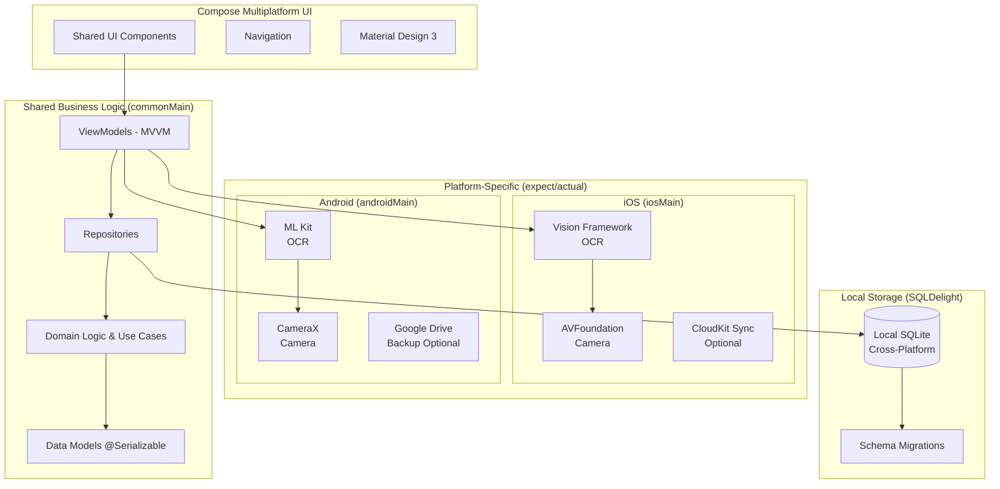

## Executive Summary - AllesTeurer Kotlin Multiplatform

**AllesTeurer** ist eine datenschutzfokussierte Kotlin Multiplatform Mobile (KMP) Anwendung zur intelligenten Preisüberwachung durch lokales Receipt-Scanning. Die App nutzt plattformspezifische OCR-Implementierungen (Vision Framework für iOS, ML Kit für Android), baut eine persönliche Preisdatenbank mit SQLDelight auf und bietet lokale Analytik - alles ohne Backend-Abhängigkeiten bei maximaler Code-Wiederverwendung.

## 🎯 Multiplatform-First Strategie

### Phase 1: KMP Foundation (3 Monate)

- **Geteilte Geschäftslogik**: 85%+ Code-Sharing zwischen iOS und Android
- **Privacy-First**: Alle Daten bleiben auf dem Gerät (SQLDelight lokal)
- **Platform-spezifische OCR**: Vision Framework (iOS) / ML Kit (Android) via expect/actual
- **Compose Multiplatform**: Geteiltes UI mit nativen Adaptionen

### Phase 2: Platform Extensions (nach Marktvalidierung)

- **Optional Backend**: Ktor server für erweiterte Features
- **Desktop Platform**: Compose Desktop support
- **Web Platform**: Kotlin/JS mit Compose for Web
- **Community Features**: Wenn gewünscht von Nutzern

## 🏗️ Kotlin Multiplatform Architecture



## 🔒 Privacy & Local-First Vorteile

### Für Nutzer

- **Komplette Datenkontrolle**: Alle Receipts und Preise bleiben lokal
- **Keine Tracking-Sorgen**: Zero third-party Analytics
- **Offline-Funktionalität**: Vollständige Features ohne Internet
- **Cross-Platform**: Gleiche Funktionen auf iOS und Android
- **Native Performance**: Direkte Kompilierung zu nativem Code

### Für Business

- **Schnellerer Launch**: 3 Monate für beide Plattformen
- **Niedrigere Kosten**: Keine Server/Backend-Infrastruktur initial
- **Code-Effizienz**: 85%+ geteilte Geschäftslogik reduziert Entwicklungszeit
- **Market Validation**: Testen der Core-Features auf beiden Plattformen parallel

## 📱 Core Features (Multiplatform)

### Receipt Scanning Engine

- **Platform-spezifische OCR**: Vision Framework (iOS) / ML Kit (Android) für deutsche Receipts
- **Automatische Extraktion**: Produktnamen, Preise, Store-Info, Datum
- **Smart Correction**: Benutzer kann OCR-Fehler einfach korrigieren
- **Local Processing**: Kein Upload von Receipt-Bildern nötig
- **Shared Business Logic**: Receipt-Parsing-Algorithmen in commonMain

### Lokale Preisdatenbank (SQLDelight)

- **Type-Safe Queries**: SQLDelight für alle Plattformen
- **Intelligentes Matching**: Fuzzy-Logic für ähnliche Produkte (shared)
- **Automatische Kategorisierung**: Shared business logic
- **Preisverlauf-Tracking**: Lokale Speicherung aller Preisdaten
- **Schema Migrations**: Versionierte Datenbankentwicklung

### Privacy-First Analytics (Shared)

- **Persönliche Inflation-Raten**: Berechnet aus eigenen Receipts (Kotlin shared code)
- **Ausgaben-Trends**: Monatliche/kategorische Übersichten
- **Cross-Platform Charts**: Compose Multiplatform Visualisierung
- **Datenexport**: CSV/PDF für eigene Analysen

## 🚀 Go-to-Market Strategie

### Target Market Deutschland

- **Primary**: Bewusste Konsumenten (25-45 Jahre) auf iOS und Android
- **Secondary**: Familien mit Budget-Fokus (beide Plattformen)
- **Tertiary**: Studenten und junge Berufstätige
- **Market Advantage**: Simultaner Launch auf beiden major Plattformen

### App Store Positioning

- **iOS Kategorie**: Finance / Shopping (Apple App Store)
- **Android Kategorie**: Finance / Shopping (Google Play Store)
- **Keywords**: "Receipt Scanner", "Preis Tracker", "Inflation", "Budget", "Privacy"
- **USP**: "Cross-platform privacy-first receipt tracking - all data stays on your device"

### Pricing Strategy (Multiplatform)

- **Launch**: Kostenlos (für Market Validation auf beiden Plattformen)
- **Premium**: €2.99/Monat für erweiterte Analytics (iOS + Android)
- **One-Time**: €19.99 für alle Features (beide App Stores)

## 🛣️ Roadmap & Evolution

### Immediate (0-3 Monate): KMP Foundation

```kotlin
✅ Receipt Scanning (Vision Framework iOS / ML Kit Android)
✅ Local Data Storage (SQLDelight cross-platform)
✅ Shared Business Logic (Kotlin Multiplatform)
✅ Basic Analytics (Compose Multiplatform Charts)
✅ Cross-Platform UI (Compose Multiplatform)
✅ App Store Launch (iOS + Android parallel)
```

### Short-term (3-6 Monate): Platform-Specific Enhancement

```kotlin
⏳ iOS Features: Shortcuts, Spotlight, Widgets, Share Extensions
⏳ Android Features: App Shortcuts, Widgets, Material You, Share Intents
⏳ Advanced Analytics (shared business logic)
⏳ Platform-specific sync (CloudKit iOS / Google Drive Android)
⏳ Accessibility improvements (both platforms)
```

### Medium-term (6-12 Monate): Backend & Desktop Expansion

```kotlin
🔮 Optional Backend Services (Ktor multiplatform server)
🔮 Desktop App (Compose Desktop)
🔮 Web App (Kotlin/JS + Compose for Web)
🔮 Real-time Price Comparison APIs
🔮 Community Features (if requested)
```

## 📊 Technical Specifications

### Multiplatform Requirements

- **iOS**: iOS 15.0+ (für Compose Multiplatform compatibility)
- **Android**: Android API 24+ (Android 7.0+) für ML Kit
- **Devices**: Mid-range+ empfohlen (für optimale OCR Performance)
- **Storage**: 100MB für app + lokale Datenbank
- **Storage**: ~50MB App + variable Daten (Receipt-Bilder)
- **Permissions**: Camera (für Receipt Scanning), CloudKit (optional)

### Performance Targets

- **App Launch**: < 2 Sekunden
- **Receipt OCR**: < 5 Sekunden processing
- **Data Queries**: < 100ms für typische Suchen
- **Memory Usage**: < 100MB normal operation

### Accessibility Compliance

- **VoiceOver**: Vollständige Screen Reader Support
- **Dynamic Type**: Automatische Text-Skalierung
- **High Contrast**: Support für Sehbehinderungen
- **Keyboard Navigation**: Vollständig navigierbar ohne Touch

## 🎯 Success Metrics (3 Monate)

### User Adoption

- **Downloads**: 10,000+ in ersten 3 Monaten
- **DAU**: 1,000+ aktive Nutzer täglich
- **Retention**: 40%+ nach 7 Tagen
- **Rating**: 4.5+ Sterne im App Store

### Business Metrics

- **Receipt Scans**: 50,000+ verarbeitete Receipts
- **User Engagement**: 3+ App-Opens pro Woche
- **Feature Usage**: 80%+ nutzen Analytics Features
- **CloudKit Adoption**: 60%+ aktivieren Geräte-Sync

## 💼 Business Case

### Entwicklungskosten (KMP-First)

- **Development**: 4 Monate (1 KMP Developer + 1 UI/UX)
- **Platform Specialists**: 0.5 Monate je iOS/Android (platform-specific features)
- **Testing**: 1 Monat (beide Plattformen parallel)
- **Total**: ~€60,000 (vs €120,000 für separate native Apps)

### Code-Effizienz Vorteile

- **Shared Business Logic**: 85%+ Code-Wiederverwendung zwischen Plattformen
- **Maintenance Reduction**: Single codebase für Core-Features
- **Bug Fix Efficiency**: Fix once, deploy everywhere
- **Feature Parity**: Automatisch synchrone Feature-Releases

### Break-Even Analysis (Multiplatform)

- **Freemium**: 3,000 Premium-Nutzer (€2.99/Monat) - both platforms combined
- **One-Time**: 3,000 Verkäufe (€19.99) - iOS + Android
- **Expected Break-Even**: 4-6 Monate nach Launch (faster due to parallel platform launch)

### Market Opportunity (Expanded)

- **TAM**: 83 Mio iPhone + 65 Mio Android Deutschland = 148 Mio devices
- **SAM**: 15 Millionen bewusste Konsumenten (both platforms)
- **SOM**: 200,000 potentielle Early Adopters (doubled addressable market)
- **Revenue Potential**: €5-40 Millionen (higher penetration through platform diversity)

## 🔄 Platform Evolution Strategy

### KMP-First Benefits

Die Kotlin Multiplatform-First Architecture bietet:

```kotlin
// Shared Business Logic (85%+ code sharing)
class ReceiptProcessor(
    private val ocrService: OCRService, // expect/actual
    private val repository: ReceiptRepository // SQLDelight
) {
    suspend fun processReceipt(imageData: ByteArray): Result<Receipt> {
        return try {
            val ocrText = ocrService.extractText(imageData)
            val parsedReceipt = parseReceiptText(ocrText) // shared logic
            repository.saveReceipt(parsedReceipt) // cross-platform storage
            Result.success(parsedReceipt)
        } catch (e: Exception) {
            Result.failure(e)
        }
    }

    // This business logic runs identical on iOS and Android
    private fun parseReceiptText(text: String): Receipt {
        // Complex parsing logic shared across platforms
        // German receipt format handling
        // Price extraction algorithms
        // Product name normalization
    }
}
```

### Future Backend Integration

Optional Ktor multiplatform backend can be added seamlessly:

```kotlin
// Current: Local-Only Repository (commonMain)
class LocalReceiptRepository(private val database: Database) : ReceiptRepository {
    override suspend fun saveReceipt(receipt: Receipt) {
        database.receiptQueries.insert(receipt.toEntity())
    }
}

// Future: Hybrid Repository with optional sync
class HybridReceiptRepository(
    private val localRepo: LocalReceiptRepository,
    private val remoteService: RemoteService // Ktor client
) : ReceiptRepository {
    override suspend fun saveReceipt(receipt: Receipt) {
        localRepo.saveReceipt(receipt) // Always save locally first

        if (networkAvailable()) {
            try {
                remoteService.syncReceipt(receipt) // Optional cloud backup
            } catch (e: Exception) {
                // Graceful fallback to local-only
            }
        }
    }
}
```

### Long-term Expansion Strategy

1. **Perfect multiplatform core** (3-6 Monate)
2. **Add platform-specific enhancements** (iOS Shortcuts, Android Widgets)
3. **Optional backend services** (wenn Feature-Nachfrage entsteht)
4. **Desktop expansion** (Compose Desktop)
5. **Web dashboard** (Kotlin/JS + Compose for Web)

## 🎉 Conclusion

**AllesTeurer Kotlin Multiplatform Strategie** maximiert:

- **Cross-Platform Efficiency**: 85%+ Code-Sharing reduziert Entwicklungszeit drastisch
- **Simultaner Launch**: iOS + Android parallel, doppelte Marktreichweite
- **User Privacy**: Lokale Datenverarbeitung ohne Backend-Abhängigkeiten
- **Development ROI**: Niedrigere Gesamtkosten durch geteilte Geschäftslogik
- **Market Validation**: Testen der Core-Features auf beiden major Plattformen
- **Native Performance**: Direct-to-native compilation auf allen Zielplattformen
- **Future-Proof**: Modulare Architektur für einfache Platform-Erweiterung

**Competitive Advantages:**

- **Time-to-Market**: 4 Monate für beide Plattformen vs 8+ Monate separate Entwicklung
- **Code Maintainability**: Single source of truth für business logic
- **Feature Consistency**: Automatische Feature-Parity zwischen Plattformen
- **Quality Assurance**: Shared tests für Core-Funktionalität

Diese KMP-First Strategie ermöglicht einen effizienten, kostengünstigen Launch mit maximaler Privacy für Nutzer bei optimaler Marktabdeckung, während die Architektur flexibel für zukünftige Erweiterungen (Backend, Desktop, Web) bleibt.

## 🎨 KMP System-Architecture

### Kotlin Multiplatform Architecture


## 📦 Technologie-Stack

### Shared (commonMain)

- **Language**: Kotlin 2.2.20+ mit K2 compiler
- **UI Framework**: Compose Multiplatform
- **Architecture**: MVVM mit Repository pattern
- **Database**: SQLDelight für type-safe cross-platform SQL
- **Concurrency**: Kotlin Coroutines + Flow
- **Serialization**: kotlinx.serialization
- **Testing**: Kotlin Test für shared business logic

### iOS Specific (iosMain)

- **OCR**: Vision Framework via expect/actual
- **Camera**: AVFoundation integration
- **Local Storage**: SQLDelight mit native SQLite driver
- **Sync**: CloudKit für optionale Device-Synchronisation
- **Navigation**: Compose Navigation + iOS-spezifische Adaptionen

### Android Specific (androidMain)

- **OCR**: ML Kit via expect/actual declarations
- **Camera**: CameraX integration
- **Local Storage**: SQLDelight mit Android SQLite
- **Sync**: Google Drive für optionale Cloud-Backup
- **Material Design**: Material You dynamic colors (Android 12+)

### Development Tools

- **Build System**: Gradle 9.0+ mit Kotlin DSL
- **IDE**: IntelliJ IDEA / Android Studio / Xcode (platform-specific)
- **CI/CD**: GitHub Actions für automated builds
- **Code Quality**: ktlint, detekt für Kotlin code analysis
- **Version Control**: Gradle version catalogs für dependency management

### Future Backend (Optional - Phase 2)

- **Server**: Ktor multiplatform server
- **Database**: PostgreSQL für cloud sync
- **Authentication**: OAuth 2.0 / JWT
- **Storage**: MinIO für cloud image backup
- **API**: GraphQL mit Ktor GraphQL plugin

## 🔧 Core Features - Detaillierte Spezifikation

### Feature 1: Produktsuche & Preisvergleich

#### User Stories

```gherkin
Feature: Product Search and Price Comparison

Scenario: Search for a product
  Given I am on the search page
  When I enter "iPhone 15" in the search field
  Then I should see a list of matching products
  And each product should show:
    - Product name and image
    - Price range (min-max)
    - Number of available sources
    - Best price indicator

Scenario: View detailed price comparison
  Given I have searched for a product
  When I click on a product card
  Then I should see:
    - All available sources with prices
    - Shipping costs for each source
    - Total cost calculation
    - Availability status
    - Direct purchase links
```

#### API Endpoints

```typescript
// GraphQL Schema
type Query {
  searchProducts(
    query: String!
    filters: ProductFilters
    pagination: PaginationInput
  ): ProductSearchResult!

  getProductPrices(
    productId: ID!
    includeShipping: Boolean = true
    location: LocationInput
  ): [PriceSource!]!
}

type ProductSearchResult {
  products: [Product!]!
  totalCount: Int!
  facets: SearchFacets
}

type PriceSource {
  source: String!
  price: Float!
  shippingCost: Float
  totalCost: Float!
  availability: AvailabilityStatus!
  url: String!
  lastUpdated: DateTime!
}
```

#### Implementation Tasks

- [ ] Design database schema for products and prices
- [ ] Implement product search with Elasticsearch
- [ ] Create web scraping service for price sources
- [ ] Build API aggregation layer
- [ ] Implement caching strategy (Redis)
- [ ] Create UI components for all platforms

### Feature 2: Intelligente Einkaufslisten-Optimierung

#### Optimization Algorithm

```python
class ShoppingListOptimizer:
    """
    Multi-objective optimization for shopping lists
    """

    def optimize(
        items: List[ShoppingItem],
        strategy: OptimizationStrategy,
        constraints: Constraints
    ) -> OptimizationResult:
        """
        Strategies:
        1. COST_MINIMUM: Minimize total cost
        2. TIME_MINIMUM: Minimize shopping time
        3. DELIVERY_BUNDLED: Optimize for fewer deliveries
        4. ECO_FRIENDLY: Minimize carbon footprint
        """

        # Step 1: Get all prices for all items
        price_matrix = self.build_price_matrix(items)

        # Step 2: Apply constraints (max stores, delivery dates)
        filtered_matrix = self.apply_constraints(price_matrix, constraints)

        # Step 3: Run optimization algorithm
        if strategy == OptimizationStrategy.COST_MINIMUM:
            return self.minimize_cost(filtered_matrix)
        elif strategy == OptimizationStrategy.TIME_MINIMUM:
            return self.minimize_time(filtered_matrix)
        # ... other strategies

    def minimize_cost(self, matrix: PriceMatrix) -> OptimizationResult:
        """
        Use dynamic programming for multi-store optimization
        """
        # Implementation using Knapsack variant
        pass
```

#### Database Schema

```sql
-- Shopping Lists
CREATE TABLE shopping_lists (
    id UUID PRIMARY KEY,
    user_id UUID REFERENCES users(id),
    name VARCHAR(255),
    created_at TIMESTAMP,
    updated_at TIMESTAMP
);

-- Shopping List Items
CREATE TABLE shopping_list_items (
    id UUID PRIMARY KEY,
    list_id UUID REFERENCES shopping_lists(id),
    product_id UUID REFERENCES products(id),
    quantity INTEGER,
    priority INTEGER,
    notes TEXT
);

-- Optimization Results
CREATE TABLE optimization_results (
    id UUID PRIMARY KEY,
    list_id UUID REFERENCES shopping_lists(id),
    strategy VARCHAR(50),
    total_cost DECIMAL(10,2),
    total_savings DECIMAL(10,2),
    recommendations JSONB,
    created_at TIMESTAMP
);
```

### Feature 3: OCR-basierte Datenerfassung

#### Receipt Processing Pipeline

```typescript
interface ReceiptProcessor {
  // Step 1: Image preprocessing
  preprocessImage(image: Buffer): Promise<ProcessedImage>;

  // Step 2: Text extraction
  extractText(image: ProcessedImage): Promise<RawText>;

  // Step 3: Parse receipt structure
  parseReceipt(text: RawText): Promise<ParsedReceipt>;

  // Step 4: Product matching
  matchProducts(items: ReceiptItem[]): Promise<Product[]>;

  // Step 5: Store in database
  saveReceipt(receipt: ParsedReceipt): Promise<Receipt>;
}

interface ParsedReceipt {
  store: Store;
  date: Date;
  items: ReceiptItem[];
  total: number;
  tax: number;
  paymentMethod: string;
}
```

#### ML Model Integration

```python
# Receipt Parser using LLM
class ReceiptParserLLM:
    def __init__(self):
        self.model = load_model("receipt-parser-v2")

    def parse(self, ocr_text: str) -> dict:
        prompt = f"""
        Parse the following receipt text and extract:
        - Store name and location
        - Purchase date and time
        - List of items with:
          - Product name
          - Quantity
          - Unit price
          - Total price
        - Tax amount
        - Total amount

        Receipt text:
        {ocr_text}

        Return as structured JSON.
        """

        response = self.model.generate(prompt)
        return json.loads(response)
```

### Feature 4: Preisschild-Scanning

#### Price Tag Recognition

```swift
// iOS Implementation
class PriceTagScanner: ObservableObject {
    private let vision = VNRecognizeTextRequest()

    func scanPriceTag(image: UIImage) async throws -> PriceTagInfo {
        // 1. Run OCR
        let text = try await extractText(from: image)

        // 2. Extract price information
        let price = extractPrice(from: text)
        let product = extractProductName(from: text)
        let unit = extractUnit(from: text)

        // 3. Get store context (from location)
        let store = await detectStore()

        // 4. Compare with database
        let comparison = await comparePrices(
            product: product,
            price: price,
            store: store
        )

        return PriceTagInfo(
            product: product,
            price: price,
            store: store,
            comparison: comparison
        )
    }

    private func extractPrice(from text: String) -> Decimal? {
        // Regex patterns for different price formats
        let patterns = [
            #"(\d+[,.]?\d*)\s*€"#,
            #"€\s*(\d+[,.]?\d*)"#,
            #"(\d+[,.]?\d*)\s*EUR"#
        ]
        // ... implementation
    }
}
```

## 🗄️ Database Design

### Complete Entity Relationship Diagram

```sql
-- Core Entities
CREATE TABLE users (
    id UUID PRIMARY KEY,
    email VARCHAR(255) UNIQUE,
    username VARCHAR(100),
    created_at TIMESTAMP,
    preferences JSONB
);

CREATE TABLE products (
    id UUID PRIMARY KEY,
    name VARCHAR(255),
    barcode VARCHAR(50),
    ean VARCHAR(13),
    category_id UUID,
    brand_id UUID,
    unit VARCHAR(50),
    description TEXT,
    image_url VARCHAR(500),
    metadata JSONB,
    created_at TIMESTAMP,
    updated_at TIMESTAMP,
    INDEX idx_barcode (barcode),
    INDEX idx_name (name)
);

CREATE TABLE categories (
    id UUID PRIMARY KEY,
    name VARCHAR(100),
    parent_id UUID REFERENCES categories(id),
    path VARCHAR(500), -- Materialized path for hierarchy
    icon VARCHAR(100)
);

CREATE TABLE brands (
    id UUID PRIMARY KEY,
    name VARCHAR(100),
    logo_url VARCHAR(500)
);

CREATE TABLE stores (
    id UUID PRIMARY KEY,
    name VARCHAR(255),
    type VARCHAR(50), -- 'online', 'physical', 'hybrid'
    website VARCHAR(500),
    address JSONB,
    coordinates POINT,
    metadata JSONB
);

-- Price Tracking
CREATE TABLE price_records (
    id UUID PRIMARY KEY,
    product_id UUID REFERENCES products(id),
    store_id UUID REFERENCES stores(id),
    price DECIMAL(10,2),
    currency VARCHAR(3),
    is_promotion BOOLEAN,
    promotion_text VARCHAR(255),
    recorded_at TIMESTAMP,
    source VARCHAR(50), -- 'manual', 'receipt', 'api', 'web_scrape'
    confidence_score FLOAT,
    INDEX idx_product_store_date (product_id, store_id, recorded_at)
);

-- Receipt Management
CREATE TABLE receipts (
    id UUID PRIMARY KEY,
    user_id UUID REFERENCES users(id),
    store_id UUID REFERENCES stores(id),
    image_url VARCHAR(500),
    ocr_text TEXT,
    parsed_data JSONB,
    total_amount DECIMAL(10,2),
    tax_amount DECIMAL(10,2),
    purchase_date TIMESTAMP,
    processing_status VARCHAR(50),
    created_at TIMESTAMP
);

CREATE TABLE receipt_items (
    id UUID PRIMARY KEY,
    receipt_id UUID REFERENCES receipts(id),
    product_id UUID REFERENCES products(id),
    raw_name VARCHAR(255),
    quantity DECIMAL(10,3),
    unit_price DECIMAL(10,2),
    total_price DECIMAL(10,2),
    matched_confidence FLOAT
);

-- Shopping Lists
CREATE TABLE shopping_lists (
    id UUID PRIMARY KEY,
    user_id UUID REFERENCES users(id),
    name VARCHAR(255),
    status VARCHAR(50),
    created_at TIMESTAMP,
    completed_at TIMESTAMP
);

CREATE TABLE shopping_list_items (
    id UUID PRIMARY KEY,
    list_id UUID REFERENCES shopping_lists(id),
    product_id UUID REFERENCES products(id),
    quantity INTEGER,
    unit VARCHAR(50),
    notes TEXT,
    is_purchased BOOLEAN DEFAULT FALSE
);

-- Optimization Results
CREATE TABLE optimization_results (
    id UUID PRIMARY KEY,
    list_id UUID REFERENCES shopping_lists(id),
    strategy VARCHAR(50),
    total_cost DECIMAL(10,2),
    total_savings DECIMAL(10,2),
    execution_time_ms INTEGER,
    recommendations JSONB,
    created_at TIMESTAMP
);

-- Price Alerts
CREATE TABLE price_alerts (
    id UUID PRIMARY KEY,
    user_id UUID REFERENCES users(id),
    product_id UUID REFERENCES products(id),
    target_price DECIMAL(10,2),
    alert_type VARCHAR(50), -- 'below_price', 'percentage_drop'
    is_active BOOLEAN DEFAULT TRUE,
    created_at TIMESTAMP,
    triggered_at TIMESTAMP
);
```

## 🔐 Security Requirements

### Authentication & Authorization

```typescript
// JWT-based authentication
interface AuthService {
  // User registration
  register(data: RegisterDto): Promise<User>;

  // Multi-factor authentication
  login(credentials: LoginDto): Promise<{
    accessToken: string;
    refreshToken: string;
    mfaRequired: boolean;
  }>;

  // OAuth providers
  oauthLogin(provider: "google" | "apple" | "facebook"): Promise<AuthTokens>;

  // Token refresh
  refreshToken(token: string): Promise<AuthTokens>;
}

// Role-based access control
enum Role {
  USER = "user",
  PREMIUM = "premium",
  ADMIN = "admin",
}

// Permission decorators
@Roles(Role.PREMIUM)
@UseGuards(JwtAuthGuard, RolesGuard)
class PremiumFeaturesController {
  // Premium-only endpoints
}
```

### Data Privacy

- GDPR compliance with data export/deletion
- End-to-end encryption for sensitive data
- Anonymous usage analytics
- Local-first approach with optional cloud sync

## 🚀 Implementation Phases

### Phase 1: Foundation (Weeks 1-4)

```yaml
tasks:
  - Setup monorepo structure
  - Configure CI/CD pipelines
  - Setup development environments
  - Create base authentication system
  - Design and implement core database schema
  - Setup API Gateway with GraphQL

deliverables:
  - Working development environment
  - Basic auth flow on all platforms
  - Database with migrations
  - API documentation
```

### Phase 2: Core Features (Weeks 5-12)

```yaml
tasks:
  - Implement product search API
  - Build price aggregation service
  - Create receipt OCR pipeline
  - Develop shopping list management
  - Basic UI for all platforms

deliverables:
  - Product search functionality
  - Receipt scanning (MVP)
  - Shopping list CRUD
  - Basic price comparison
```

### Phase 3: Intelligence Layer (Weeks 13-18)

```yaml
tasks:
  - Implement optimization algorithms
  - Train ML models for product matching
  - Build recommendation engine
  - Create price prediction models

deliverables:
  - Smart shopping list optimizer
  - Product matching with 90%+ accuracy
  - Price trend analysis
  - Personalized recommendations
```

### Phase 4: Advanced Features (Weeks 19-24)

```yaml
tasks:
  - Price tag scanning
  - Advanced analytics dashboard
  - Social features (list sharing)
  - Premium features implementation

deliverables:
  - Real-time price tag comparison
  - Comprehensive analytics
  - Social sharing capabilities
  - Subscription system
```

### Phase 5: Polish & Launch (Weeks 25-28)

```yaml
tasks:
  - Performance optimization
  - Security audit
  - App store preparations
  - Marketing website
  - Beta testing program

deliverables:
  - Production-ready applications
  - App store listings
  - Marketing materials
  - Launch strategy
```

## 📊 Success Metrics

### Technical KPIs

- API response time < 200ms (p95)
- Receipt OCR accuracy > 95%
- Product matching accuracy > 90%
- App crash rate < 0.5%
- Test coverage > 80%

### Business KPIs

- User acquisition cost < €5
- Monthly active users > 10,000 (Year 1)
- User retention (Day 30) > 40%
- Premium conversion rate > 5%
- App store rating > 4.5 stars

## 🧪 Testing Strategy

### Testing Pyramid

```
     /\
    /  \    E2E Tests (10%)
   /    \   - Critical user journeys
  /------\
 /        \ Integration Tests (30%)
/          \- API testing
```
