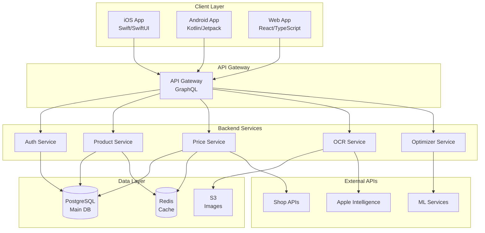

## Executive Summary
**Alles Teuer** ist eine Multi-Plattform-Anwendung (iOS, Android, Web) zur intelligenten Preisüberwachung und Einkaufsoptimierung. Die App nutzt moderne KI-Technologien zur automatischen Datenextraktion aus Kassenbons und Preisschildern, baut eine umfassende Preisdatenbank auf und bietet intelligente Einkaufsempfehlungen.

## 🎨 System-Architektur

### High-Level Architecture


## 📦 Technologie-Stack

### Backend
- **Runtime**: Node.js 20+ mit TypeScript
- **Framework**: NestJS (modular, enterprise-ready)
- **API**: GraphQL mit Apollo Server
- **Database**: PostgreSQL 15+ mit Prisma ORM
- **Cache**: Redis für Session & Query Cache
- **Queue**: Bull/Redis für Background Jobs
- **Storage**: AWS S3 oder MinIO für Bilder

### Frontend Shared
- **State Management**: Redux Toolkit
- **API Client**: Apollo Client (GraphQL)
- **Validation**: Zod
- **Testing**: Jest + React Testing Library

### iOS Specific
- **Language**: Swift 5.9+
- **UI**: SwiftUI
- **Persistence**: Core Data + CloudKit
- **OCR**: Vision Framework
- **ML**: Core ML + Apple Intelligence

### Android Specific
- **Language**: Kotlin
- **UI**: Jetpack Compose
- **Persistence**: Room Database
- **OCR**: ML Kit
- **Architecture**: MVVM mit Hilt

### Web Specific
- **Framework**: Next.js 14 (App Router)
- **UI**: React 18 + Tailwind CSS
- **Components**: shadcn/ui
- **PWA**: Service Worker für Offline

## 🔧 Core Features - Detaillierte Spezifikation

### Feature 1: Produktsuche & Preisvergleich

#### User Stories
```gherkin
Feature: Product Search and Price Comparison

Scenario: Search for a product
  Given I am on the search page
  When I enter "iPhone 15" in the search field
  Then I should see a list of matching products
  And each product should show:
    - Product name and image
    - Price range (min-max)
    - Number of available sources
    - Best price indicator

Scenario: View detailed price comparison
  Given I have searched for a product
  When I click on a product card
  Then I should see:
    - All available sources with prices
    - Shipping costs for each source
    - Total cost calculation
    - Availability status
    - Direct purchase links
```

#### API Endpoints
```typescript
// GraphQL Schema
type Query {
  searchProducts(
    query: String!
    filters: ProductFilters
    pagination: PaginationInput
  ): ProductSearchResult!
  
  getProductPrices(
    productId: ID!
    includeShipping: Boolean = true
    location: LocationInput
  ): [PriceSource!]!
}

type ProductSearchResult {
  products: [Product!]!
  totalCount: Int!
  facets: SearchFacets
}

type PriceSource {
  source: String!
  price: Float!
  shippingCost: Float
  totalCost: Float!
  availability: AvailabilityStatus!
  url: String!
  lastUpdated: DateTime!
}
```

#### Implementation Tasks
- [ ] Design database schema for products and prices
- [ ] Implement product search with Elasticsearch
- [ ] Create web scraping service for price sources
- [ ] Build API aggregation layer
- [ ] Implement caching strategy (Redis)
- [ ] Create UI components for all platforms

### Feature 2: Intelligente Einkaufslisten-Optimierung

#### Optimization Algorithm
```python
class ShoppingListOptimizer:
    """
    Multi-objective optimization for shopping lists
    """
    
    def optimize(
        items: List[ShoppingItem],
        strategy: OptimizationStrategy,
        constraints: Constraints
    ) -> OptimizationResult:
        """
        Strategies:
        1. COST_MINIMUM: Minimize total cost
        2. TIME_MINIMUM: Minimize shopping time
        3. DELIVERY_BUNDLED: Optimize for fewer deliveries
        4. ECO_FRIENDLY: Minimize carbon footprint
        """
        
        # Step 1: Get all prices for all items
        price_matrix = self.build_price_matrix(items)
        
        # Step 2: Apply constraints (max stores, delivery dates)
        filtered_matrix = self.apply_constraints(price_matrix, constraints)
        
        # Step 3: Run optimization algorithm
        if strategy == OptimizationStrategy.COST_MINIMUM:
            return self.minimize_cost(filtered_matrix)
        elif strategy == OptimizationStrategy.TIME_MINIMUM:
            return self.minimize_time(filtered_matrix)
        # ... other strategies
        
    def minimize_cost(self, matrix: PriceMatrix) -> OptimizationResult:
        """
        Use dynamic programming for multi-store optimization
        """
        # Implementation using Knapsack variant
        pass
```

#### Database Schema
```sql
-- Shopping Lists
CREATE TABLE shopping_lists (
    id UUID PRIMARY KEY,
    user_id UUID REFERENCES users(id),
    name VARCHAR(255),
    created_at TIMESTAMP,
    updated_at TIMESTAMP
);

-- Shopping List Items
CREATE TABLE shopping_list_items (
    id UUID PRIMARY KEY,
    list_id UUID REFERENCES shopping_lists(id),
    product_id UUID REFERENCES products(id),
    quantity INTEGER,
    priority INTEGER,
    notes TEXT
);

-- Optimization Results
CREATE TABLE optimization_results (
    id UUID PRIMARY KEY,
    list_id UUID REFERENCES shopping_lists(id),
    strategy VARCHAR(50),
    total_cost DECIMAL(10,2),
    total_savings DECIMAL(10,2),
    recommendations JSONB,
    created_at TIMESTAMP
);
```

### Feature 3: OCR-basierte Datenerfassung

#### Receipt Processing Pipeline
```typescript
interface ReceiptProcessor {
  // Step 1: Image preprocessing
  preprocessImage(image: Buffer): Promise<ProcessedImage>
  
  // Step 2: Text extraction
  extractText(image: ProcessedImage): Promise<RawText>
  
  // Step 3: Parse receipt structure
  parseReceipt(text: RawText): Promise<ParsedReceipt>
  
  // Step 4: Product matching
  matchProducts(items: ReceiptItem[]): Promise<Product[]>
  
  // Step 5: Store in database
  saveReceipt(receipt: ParsedReceipt): Promise<Receipt>
}

interface ParsedReceipt {
  store: Store
  date: Date
  items: ReceiptItem[]
  total: number
  tax: number
  paymentMethod: string
}
```

#### ML Model Integration
```python
# Receipt Parser using LLM
class ReceiptParserLLM:
    def __init__(self):
        self.model = load_model("receipt-parser-v2")
        
    def parse(self, ocr_text: str) -> dict:
        prompt = f"""
        Parse the following receipt text and extract:
        - Store name and location
        - Purchase date and time
        - List of items with:
          - Product name
          - Quantity
          - Unit price
          - Total price
        - Tax amount
        - Total amount
        
        Receipt text:
        {ocr_text}
        
        Return as structured JSON.
        """
        
        response = self.model.generate(prompt)
        return json.loads(response)
```

### Feature 4: Preisschild-Scanning

#### Price Tag Recognition
```swift
// iOS Implementation
class PriceTagScanner: ObservableObject {
    private let vision = VNRecognizeTextRequest()
    
    func scanPriceTag(image: UIImage) async throws -> PriceTagInfo {
        // 1. Run OCR
        let text = try await extractText(from: image)
        
        // 2. Extract price information
        let price = extractPrice(from: text)
        let product = extractProductName(from: text)
        let unit = extractUnit(from: text)
        
        // 3. Get store context (from location)
        let store = await detectStore()
        
        // 4. Compare with database
        let comparison = await comparePrices(
            product: product,
            price: price,
            store: store
        )
        
        return PriceTagInfo(
            product: product,
            price: price,
            store: store,
            comparison: comparison
        )
    }
    
    private func extractPrice(from text: String) -> Decimal? {
        // Regex patterns for different price formats
        let patterns = [
            #"(\d+[,.]?\d*)\s*€"#,
            #"€\s*(\d+[,.]?\d*)"#,
            #"(\d+[,.]?\d*)\s*EUR"#
        ]
        // ... implementation
    }
}
```

## 🗄️ Database Design

### Complete Entity Relationship Diagram
```sql
-- Core Entities
CREATE TABLE users (
    id UUID PRIMARY KEY,
    email VARCHAR(255) UNIQUE,
    username VARCHAR(100),
    created_at TIMESTAMP,
    preferences JSONB
);

CREATE TABLE products (
    id UUID PRIMARY KEY,
    name VARCHAR(255),
    barcode VARCHAR(50),
    ean VARCHAR(13),
    category_id UUID,
    brand_id UUID,
    unit VARCHAR(50),
    description TEXT,
    image_url VARCHAR(500),
    metadata JSONB,
    created_at TIMESTAMP,
    updated_at TIMESTAMP,
    INDEX idx_barcode (barcode),
    INDEX idx_name (name)
);

CREATE TABLE categories (
    id UUID PRIMARY KEY,
    name VARCHAR(100),
    parent_id UUID REFERENCES categories(id),
    path VARCHAR(500), -- Materialized path for hierarchy
    icon VARCHAR(100)
);

CREATE TABLE brands (
    id UUID PRIMARY KEY,
    name VARCHAR(100),
    logo_url VARCHAR(500)
);

CREATE TABLE stores (
    id UUID PRIMARY KEY,
    name VARCHAR(255),
    type VARCHAR(50), -- 'online', 'physical', 'hybrid'
    website VARCHAR(500),
    address JSONB,
    coordinates POINT,
    metadata JSONB
);

-- Price Tracking
CREATE TABLE price_records (
    id UUID PRIMARY KEY,
    product_id UUID REFERENCES products(id),
    store_id UUID REFERENCES stores(id),
    price DECIMAL(10,2),
    currency VARCHAR(3),
    is_promotion BOOLEAN,
    promotion_text VARCHAR(255),
    recorded_at TIMESTAMP,
    source VARCHAR(50), -- 'manual', 'receipt', 'api', 'web_scrape'
    confidence_score FLOAT,
    INDEX idx_product_store_date (product_id, store_id, recorded_at)
);

-- Receipt Management
CREATE TABLE receipts (
    id UUID PRIMARY KEY,
    user_id UUID REFERENCES users(id),
    store_id UUID REFERENCES stores(id),
    image_url VARCHAR(500),
    ocr_text TEXT,
    parsed_data JSONB,
    total_amount DECIMAL(10,2),
    tax_amount DECIMAL(10,2),
    purchase_date TIMESTAMP,
    processing_status VARCHAR(50),
    created_at TIMESTAMP
);

CREATE TABLE receipt_items (
    id UUID PRIMARY KEY,
    receipt_id UUID REFERENCES receipts(id),
    product_id UUID REFERENCES products(id),
    raw_name VARCHAR(255),
    quantity DECIMAL(10,3),
    unit_price DECIMAL(10,2),
    total_price DECIMAL(10,2),
    matched_confidence FLOAT
);

-- Shopping Lists
CREATE TABLE shopping_lists (
    id UUID PRIMARY KEY,
    user_id UUID REFERENCES users(id),
    name VARCHAR(255),
    status VARCHAR(50),
    created_at TIMESTAMP,
    completed_at TIMESTAMP
);

CREATE TABLE shopping_list_items (
    id UUID PRIMARY KEY,
    list_id UUID REFERENCES shopping_lists(id),
    product_id UUID REFERENCES products(id),
    quantity INTEGER,
    unit VARCHAR(50),
    notes TEXT,
    is_purchased BOOLEAN DEFAULT FALSE
);

-- Optimization Results
CREATE TABLE optimization_results (
    id UUID PRIMARY KEY,
    list_id UUID REFERENCES shopping_lists(id),
    strategy VARCHAR(50),
    total_cost DECIMAL(10,2),
    total_savings DECIMAL(10,2),
    execution_time_ms INTEGER,
    recommendations JSONB,
    created_at TIMESTAMP
);

-- Price Alerts
CREATE TABLE price_alerts (
    id UUID PRIMARY KEY,
    user_id UUID REFERENCES users(id),
    product_id UUID REFERENCES products(id),
    target_price DECIMAL(10,2),
    alert_type VARCHAR(50), -- 'below_price', 'percentage_drop'
    is_active BOOLEAN DEFAULT TRUE,
    created_at TIMESTAMP,
    triggered_at TIMESTAMP
);
```

## 🔐 Security Requirements

### Authentication & Authorization
```typescript
// JWT-based authentication
interface AuthService {
  // User registration
  register(data: RegisterDto): Promise<User>
  
  // Multi-factor authentication
  login(credentials: LoginDto): Promise<{
    accessToken: string
    refreshToken: string
    mfaRequired: boolean
  }>
  
  // OAuth providers
  oauthLogin(provider: 'google' | 'apple' | 'facebook'): Promise<AuthTokens>
  
  // Token refresh
  refreshToken(token: string): Promise<AuthTokens>
}

// Role-based access control
enum Role {
  USER = 'user',
  PREMIUM = 'premium',
  ADMIN = 'admin'
}

// Permission decorators
@Roles(Role.PREMIUM)
@UseGuards(JwtAuthGuard, RolesGuard)
class PremiumFeaturesController {
  // Premium-only endpoints
}
```

### Data Privacy
- GDPR compliance with data export/deletion
- End-to-end encryption for sensitive data
- Anonymous usage analytics
- Local-first approach with optional cloud sync

## 🚀 Implementation Phases

### Phase 1: Foundation (Weeks 1-4)
```yaml
tasks:
  - Setup monorepo structure
  - Configure CI/CD pipelines
  - Setup development environments
  - Create base authentication system
  - Design and implement core database schema
  - Setup API Gateway with GraphQL
  
deliverables:
  - Working development environment
  - Basic auth flow on all platforms
  - Database with migrations
  - API documentation
```

### Phase 2: Core Features (Weeks 5-12)
```yaml
tasks:
  - Implement product search API
  - Build price aggregation service
  - Create receipt OCR pipeline
  - Develop shopping list management
  - Basic UI for all platforms
  
deliverables:
  - Product search functionality
  - Receipt scanning (MVP)
  - Shopping list CRUD
  - Basic price comparison
```

### Phase 3: Intelligence Layer (Weeks 13-18)
```yaml
tasks:
  - Implement optimization algorithms
  - Train ML models for product matching
  - Build recommendation engine
  - Create price prediction models
  
deliverables:
  - Smart shopping list optimizer
  - Product matching with 90%+ accuracy
  - Price trend analysis
  - Personalized recommendations
```

### Phase 4: Advanced Features (Weeks 19-24)
```yaml
tasks:
  - Price tag scanning
  - Advanced analytics dashboard
  - Social features (list sharing)
  - Premium features implementation
  
deliverables:
  - Real-time price tag comparison
  - Comprehensive analytics
  - Social sharing capabilities
  - Subscription system
```

### Phase 5: Polish & Launch (Weeks 25-28)
```yaml
tasks:
  - Performance optimization
  - Security audit
  - App store preparations
  - Marketing website
  - Beta testing program
  
deliverables:
  - Production-ready applications
  - App store listings
  - Marketing materials
  - Launch strategy
```

## 📊 Success Metrics

### Technical KPIs
- API response time < 200ms (p95)
- Receipt OCR accuracy > 95%
- Product matching accuracy > 90%
- App crash rate < 0.5%
- Test coverage > 80%

### Business KPIs
- User acquisition cost < €5
- Monthly active users > 10,000 (Year 1)
- User retention (Day 30) > 40%
- Premium conversion rate > 5%
- App store rating > 4.5 stars

## 🧪 Testing Strategy

### Testing Pyramid
```
     /\
    /  \    E2E Tests (10%)
   /    \   - Critical user journeys
  /------\  
 /        \ Integration Tests (30%)
/          \- API testing
