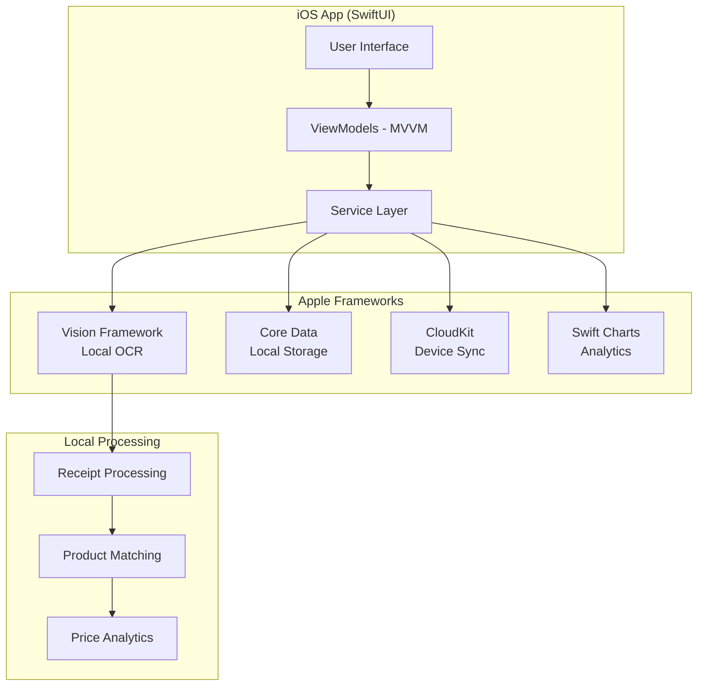

## Executive Summary - AllesTeurer iOS-First

**Alles Teuer** startet als privacy-erste iOS-Anwendung zur intelligenten Preisüberwachung durch lokales Receipt-Scanning. Die App nutzt Apple's Vision Framework für OCR-Verarbeitung, baut eine persönliche Preisdatenbank auf und bietet lokale Analytik - alles ohne Backend-Abhängigkeiten.

## 🎯 iOS-First Strategie

### Phase 1: iOS Launch (3 Monate)

- **Vollständig lokale App** ohne Server-Abhängigkeiten
- **Privacy-First**: Alle Daten bleiben auf dem Gerät
- **Apple Intelligence**: Vision Framework + Natural Language
- **CloudKit Sync**: Optional für Geräte-übergreifende Synchronisation

### Phase 2: Evolution (nach Marktvalidierung)

- **Optional Backend**: Für erweiterte Features
- **Multi-Platform**: Android und Web als Ergänzung
- **Community Features**: Wenn gewünscht von Nutzern

## 🏗️ iOS-Native Architecture



## 🔒 Privacy & Local-First Vorteile

### Für Nutzer

- **Komplette Datenkontrolle**: Alle Receipts und Preise bleiben lokal
- **Keine Tracking-Sorgen**: Zero third-party Analytics
- **Offline-Funktionalität**: Vollständige Features ohne Internet
- **Apple-Ökosystem**: Nahtlose Integration mit iCloud/CloudKit

### Für Business

- **Schnellerer Launch**: 3 Monate statt 6-8 Monate
- **Niedrigere Kosten**: Keine Server/Backend-Infrastruktur initial
- **Bessere App Store Performance**: Native iOS-Performance
- **Market Validation**: Testen der Core-Features vor Backend-Investition

## 📱 Core Features (iOS-First)

### Receipt Scanning Engine

- **Apple Vision Framework**: State-of-the-art OCR für deutsche Receipts
- **Automatische Extraktion**: Produktnamen, Preise, Store-Info, Datum
- **Smart Correction**: Benutzer kann OCR-Fehler einfach korrigieren
- **Local Processing**: Kein Upload von Receipt-Bildern nötig

### Lokale Preisdatenbank

- **Intelligentes Matching**: Fuzzy-Logic für ähnliche Produkte
- **Automatische Kategorisierung**: Mit Natural Language Framework
- **Preisverlauf-Tracking**: Lokale Speicherung aller Preisdaten
- **Swift Charts Integration**: Native iOS Charts für Visualisierung

### Privacy-First Analytics

- **Persönliche Inflation-Raten**: Berechnet aus eigenen Receipts
- **Ausgaben-Trends**: Monatliche/kategorische Übersichten
- **No-Cloud Analytics**: Alle Berechnungen lokal auf dem Gerät
- **Datenexport**: CSV/PDF für eigene Analysen

## 🚀 Go-to-Market Strategie

### Target Market Deutschland

- **Primary**: Bewusste Konsumenten (25-45 Jahre)
- **Secondary**: Familien mit Budget-Fokus
- **Tertiary**: Studenten und junge Berufstätige

### App Store Positioning

- **Kategorie**: Finance / Shopping
- **Keywords**: "Receipt Scanner", "Preis Tracker", "Inflation", "Budget"
- **USP**: "Privacy-first receipt tracking - all data stays on your device"

### Pricing Strategy (Empfehlung)

- **Launch**: Kostenlos (für Market Validation)
- **Premium**: €2.99/Monat für erweiterte Analytics
- **One-Time**: €19.99 für alle Features (App Store bevorzugt)

## 🛣️ Roadmap & Evolution

### Immediate (0-3 Monate): iOS Foundation

```swift
✅ Receipt Scanning (Vision Framework)
✅ Local Data Storage (Core Data)
✅ Basic Analytics (Swift Charts)
✅ CloudKit Sync (Optional)
✅ App Store Launch
```

### Short-term (3-6 Monate): Enhancement

```swift
⏳ Advanced Analytics Features
⏳ iOS Shortcuts Integration
⏳ Widget Support
⏳ Share Extensions
⏳ Spotlight Integration
```

### Medium-term (6-12 Monate): Expansion

```javascript
🔮 Backend Services (wenn benötigt)
🔮 Real-time Price Comparison
🔮 Android App
🔮 Web Dashboard
🔮 API für Third-Parties
```

## 📊 Technical Specifications

### iOS Requirements

- **Minimum iOS**: 17.0+ (für Vision Framework Features)
- **Devices**: iPhone 12+ empfohlen (für optimale Camera/OCR Performance)
- **Storage**: ~50MB App + variable Daten (Receipt-Bilder)
- **Permissions**: Camera (für Receipt Scanning), CloudKit (optional)

### Performance Targets

- **App Launch**: < 2 Sekunden
- **Receipt OCR**: < 5 Sekunden processing
- **Data Queries**: < 100ms für typische Suchen
- **Memory Usage**: < 100MB normal operation

### Accessibility Compliance

- **VoiceOver**: Vollständige Screen Reader Support
- **Dynamic Type**: Automatische Text-Skalierung
- **High Contrast**: Support für Sehbehinderungen
- **Keyboard Navigation**: Vollständig navigierbar ohne Touch

## 🎯 Success Metrics (3 Monate)

### User Adoption

- **Downloads**: 10,000+ in ersten 3 Monaten
- **DAU**: 1,000+ aktive Nutzer täglich
- **Retention**: 40%+ nach 7 Tagen
- **Rating**: 4.5+ Sterne im App Store

### Business Metrics

- **Receipt Scans**: 50,000+ verarbeitete Receipts
- **User Engagement**: 3+ App-Opens pro Woche
- **Feature Usage**: 80%+ nutzen Analytics Features
- **CloudKit Adoption**: 60%+ aktivieren Geräte-Sync

## 💼 Business Case

### Entwicklungskosten (iOS-First)

- **Development**: 3 Monate (1 iOS Developer)
- **Design**: 0.5 Monate (UI/UX)
- **Testing**: 0.5 Monate (QA)
- **Total**: ~€40,000 (vs €120,000 für Full-Stack)

### Break-Even Analysis

- **Freemium**: 5,000 Premium-Nutzer (€2.99/Monat)
- **One-Time**: 2,000 Verkäufe (€19.99)
- **Expected Break-Even**: 6-8 Monate nach Launch

### Market Opportunity

- **TAM**: 83 Millionen iPhone-Nutzer Deutschland
- **SAM**: 8 Millionen bewusste Konsumenten
- **SOM**: 100,000 potentielle Early Adopters
- **Revenue Potential**: €2-20 Millionen (bei verschiedenen Penetration-Raten)

## 🔄 Migration zu Multi-Platform

### Backend Integration (wenn nötig)

Die iOS-First Architecture unterstützt nahtlose Backend-Integration:

```swift
// Aktuell: Local-Only Service
class LocalPriceService {
    func savePrice(_ price: PriceRecord) {
        dataManager.save(price) // Core Data
    }
}

// Zukunft: Hybrid Service
class HybridPriceService: LocalPriceService {
    override func savePrice(_ price: PriceRecord) {
        super.savePrice(price) // Lokal speichern

        if NetworkService.isAvailable {
            Task { await syncWithBackend(price) } // Optional sync
        }
    }
}
```

### Platform Expansion Strategy

1. **iOS perfektionieren** (3-6 Monate)
2. **Backend optional hinzufügen** (wenn Feature-Nachfrage)
3. **Android parallel entwickeln** (3 Monate nach iOS)
4. **Web Dashboard** (für Power-User)

## 🎉 Conclusion

**AllesTeurer iOS-First Strategie** maximiert:

- **Time-to-Market**: 3 Monate vs 6+ Monate
- **User Privacy**: Keine Server-seitige Datenverarbeitung
- **Development ROI**: Niedrigere Initial-Kosten
- **Market Validation**: Testen der Core-Features ohne komplexe Infrastruktur
- **Apple Platform Integration**: Native Performance und Features

Diese Strategie ermöglicht einen schnellen, kostengünstigen Launch mit maximaler Privacy für Nutzer, während die Architektur flexibel für zukünftige Erweiterungen bleibt.

## 🎨 System-Architektur

### High-Level Architecture


## 📦 Technologie-Stack

### Backend

- **Runtime**: Node.js 20+ mit TypeScript
- **Framework**: NestJS (modular, enterprise-ready)
- **API**: GraphQL mit Apollo Server
- **Database**: PostgreSQL 15+ mit Prisma ORM
- **Cache**: Redis für Session & Query Cache
- **Queue**: Bull/Redis für Background Jobs
- **Storage**: AWS S3 oder MinIO für Bilder

### Frontend Shared

- **State Management**: Redux Toolkit
- **API Client**: Apollo Client (GraphQL)
- **Validation**: Zod
- **Testing**: Jest + React Testing Library

### iOS Specific

- **Language**: Swift 5.9+
- **UI**: SwiftUI
- **Persistence**: Core Data + CloudKit
- **OCR**: Vision Framework
- **ML**: Core ML + Apple Intelligence

### Android Specific

- **Language**: Kotlin
- **UI**: Jetpack Compose
- **Persistence**: Room Database
- **OCR**: ML Kit
- **Architecture**: MVVM mit Hilt

### Web Specific

- **Framework**: Next.js 14 (App Router)
- **UI**: React 18 + Tailwind CSS
- **Components**: shadcn/ui
- **PWA**: Service Worker für Offline

## 🔧 Core Features - Detaillierte Spezifikation

### Feature 1: Produktsuche & Preisvergleich

#### User Stories

```gherkin
Feature: Product Search and Price Comparison

Scenario: Search for a product
  Given I am on the search page
  When I enter "iPhone 15" in the search field
  Then I should see a list of matching products
  And each product should show:
    - Product name and image
    - Price range (min-max)
    - Number of available sources
    - Best price indicator

Scenario: View detailed price comparison
  Given I have searched for a product
  When I click on a product card
  Then I should see:
    - All available sources with prices
    - Shipping costs for each source
    - Total cost calculation
    - Availability status
    - Direct purchase links
```

#### API Endpoints

```typescript
// GraphQL Schema
type Query {
  searchProducts(
    query: String!
    filters: ProductFilters
    pagination: PaginationInput
  ): ProductSearchResult!

  getProductPrices(
    productId: ID!
    includeShipping: Boolean = true
    location: LocationInput
  ): [PriceSource!]!
}

type ProductSearchResult {
  products: [Product!]!
  totalCount: Int!
  facets: SearchFacets
}

type PriceSource {
  source: String!
  price: Float!
  shippingCost: Float
  totalCost: Float!
  availability: AvailabilityStatus!
  url: String!
  lastUpdated: DateTime!
}
```

#### Implementation Tasks

- [ ] Design database schema for products and prices
- [ ] Implement product search with Elasticsearch
- [ ] Create web scraping service for price sources
- [ ] Build API aggregation layer
- [ ] Implement caching strategy (Redis)
- [ ] Create UI components for all platforms

### Feature 2: Intelligente Einkaufslisten-Optimierung

#### Optimization Algorithm

```python
class ShoppingListOptimizer:
    """
    Multi-objective optimization for shopping lists
    """

    def optimize(
        items: List[ShoppingItem],
        strategy: OptimizationStrategy,
        constraints: Constraints
    ) -> OptimizationResult:
        """
        Strategies:
        1. COST_MINIMUM: Minimize total cost
        2. TIME_MINIMUM: Minimize shopping time
        3. DELIVERY_BUNDLED: Optimize for fewer deliveries
        4. ECO_FRIENDLY: Minimize carbon footprint
        """

        # Step 1: Get all prices for all items
        price_matrix = self.build_price_matrix(items)

        # Step 2: Apply constraints (max stores, delivery dates)
        filtered_matrix = self.apply_constraints(price_matrix, constraints)

        # Step 3: Run optimization algorithm
        if strategy == OptimizationStrategy.COST_MINIMUM:
            return self.minimize_cost(filtered_matrix)
        elif strategy == OptimizationStrategy.TIME_MINIMUM:
            return self.minimize_time(filtered_matrix)
        # ... other strategies

    def minimize_cost(self, matrix: PriceMatrix) -> OptimizationResult:
        """
        Use dynamic programming for multi-store optimization
        """
        # Implementation using Knapsack variant
        pass
```

#### Database Schema

```sql
-- Shopping Lists
CREATE TABLE shopping_lists (
    id UUID PRIMARY KEY,
    user_id UUID REFERENCES users(id),
    name VARCHAR(255),
    created_at TIMESTAMP,
    updated_at TIMESTAMP
);

-- Shopping List Items
CREATE TABLE shopping_list_items (
    id UUID PRIMARY KEY,
    list_id UUID REFERENCES shopping_lists(id),
    product_id UUID REFERENCES products(id),
    quantity INTEGER,
    priority INTEGER,
    notes TEXT
);

-- Optimization Results
CREATE TABLE optimization_results (
    id UUID PRIMARY KEY,
    list_id UUID REFERENCES shopping_lists(id),
    strategy VARCHAR(50),
    total_cost DECIMAL(10,2),
    total_savings DECIMAL(10,2),
    recommendations JSONB,
    created_at TIMESTAMP
);
```

### Feature 3: OCR-basierte Datenerfassung

#### Receipt Processing Pipeline

```typescript
interface ReceiptProcessor {
  // Step 1: Image preprocessing
  preprocessImage(image: Buffer): Promise<ProcessedImage>;

  // Step 2: Text extraction
  extractText(image: ProcessedImage): Promise<RawText>;

  // Step 3: Parse receipt structure
  parseReceipt(text: RawText): Promise<ParsedReceipt>;

  // Step 4: Product matching
  matchProducts(items: ReceiptItem[]): Promise<Product[]>;

  // Step 5: Store in database
  saveReceipt(receipt: ParsedReceipt): Promise<Receipt>;
}

interface ParsedReceipt {
  store: Store;
  date: Date;
  items: ReceiptItem[];
  total: number;
  tax: number;
  paymentMethod: string;
}
```

#### ML Model Integration

```python
# Receipt Parser using LLM
class ReceiptParserLLM:
    def __init__(self):
        self.model = load_model("receipt-parser-v2")

    def parse(self, ocr_text: str) -> dict:
        prompt = f"""
        Parse the following receipt text and extract:
        - Store name and location
        - Purchase date and time
        - List of items with:
          - Product name
          - Quantity
          - Unit price
          - Total price
        - Tax amount
        - Total amount

        Receipt text:
        {ocr_text}

        Return as structured JSON.
        """

        response = self.model.generate(prompt)
        return json.loads(response)
```

### Feature 4: Preisschild-Scanning

#### Price Tag Recognition

```swift
// iOS Implementation
class PriceTagScanner: ObservableObject {
    private let vision = VNRecognizeTextRequest()

    func scanPriceTag(image: UIImage) async throws -> PriceTagInfo {
        // 1. Run OCR
        let text = try await extractText(from: image)

        // 2. Extract price information
        let price = extractPrice(from: text)
        let product = extractProductName(from: text)
        let unit = extractUnit(from: text)

        // 3. Get store context (from location)
        let store = await detectStore()

        // 4. Compare with database
        let comparison = await comparePrices(
            product: product,
            price: price,
            store: store
        )

        return PriceTagInfo(
            product: product,
            price: price,
            store: store,
            comparison: comparison
        )
    }

    private func extractPrice(from text: String) -> Decimal? {
        // Regex patterns for different price formats
        let patterns = [
            #"(\d+[,.]?\d*)\s*€"#,
            #"€\s*(\d+[,.]?\d*)"#,
            #"(\d+[,.]?\d*)\s*EUR"#
        ]
        // ... implementation
    }
}
```

## 🗄️ Database Design

### Complete Entity Relationship Diagram

```sql
-- Core Entities
CREATE TABLE users (
    id UUID PRIMARY KEY,
    email VARCHAR(255) UNIQUE,
    username VARCHAR(100),
    created_at TIMESTAMP,
    preferences JSONB
);

CREATE TABLE products (
    id UUID PRIMARY KEY,
    name VARCHAR(255),
    barcode VARCHAR(50),
    ean VARCHAR(13),
    category_id UUID,
    brand_id UUID,
    unit VARCHAR(50),
    description TEXT,
    image_url VARCHAR(500),
    metadata JSONB,
    created_at TIMESTAMP,
    updated_at TIMESTAMP,
    INDEX idx_barcode (barcode),
    INDEX idx_name (name)
);

CREATE TABLE categories (
    id UUID PRIMARY KEY,
    name VARCHAR(100),
    parent_id UUID REFERENCES categories(id),
    path VARCHAR(500), -- Materialized path for hierarchy
    icon VARCHAR(100)
);

CREATE TABLE brands (
    id UUID PRIMARY KEY,
    name VARCHAR(100),
    logo_url VARCHAR(500)
);

CREATE TABLE stores (
    id UUID PRIMARY KEY,
    name VARCHAR(255),
    type VARCHAR(50), -- 'online', 'physical', 'hybrid'
    website VARCHAR(500),
    address JSONB,
    coordinates POINT,
    metadata JSONB
);

-- Price Tracking
CREATE TABLE price_records (
    id UUID PRIMARY KEY,
    product_id UUID REFERENCES products(id),
    store_id UUID REFERENCES stores(id),
    price DECIMAL(10,2),
    currency VARCHAR(3),
    is_promotion BOOLEAN,
    promotion_text VARCHAR(255),
    recorded_at TIMESTAMP,
    source VARCHAR(50), -- 'manual', 'receipt', 'api', 'web_scrape'
    confidence_score FLOAT,
    INDEX idx_product_store_date (product_id, store_id, recorded_at)
);

-- Receipt Management
CREATE TABLE receipts (
    id UUID PRIMARY KEY,
    user_id UUID REFERENCES users(id),
    store_id UUID REFERENCES stores(id),
    image_url VARCHAR(500),
    ocr_text TEXT,
    parsed_data JSONB,
    total_amount DECIMAL(10,2),
    tax_amount DECIMAL(10,2),
    purchase_date TIMESTAMP,
    processing_status VARCHAR(50),
    created_at TIMESTAMP
);

CREATE TABLE receipt_items (
    id UUID PRIMARY KEY,
    receipt_id UUID REFERENCES receipts(id),
    product_id UUID REFERENCES products(id),
    raw_name VARCHAR(255),
    quantity DECIMAL(10,3),
    unit_price DECIMAL(10,2),
    total_price DECIMAL(10,2),
    matched_confidence FLOAT
);

-- Shopping Lists
CREATE TABLE shopping_lists (
    id UUID PRIMARY KEY,
    user_id UUID REFERENCES users(id),
    name VARCHAR(255),
    status VARCHAR(50),
    created_at TIMESTAMP,
    completed_at TIMESTAMP
);

CREATE TABLE shopping_list_items (
    id UUID PRIMARY KEY,
    list_id UUID REFERENCES shopping_lists(id),
    product_id UUID REFERENCES products(id),
    quantity INTEGER,
    unit VARCHAR(50),
    notes TEXT,
    is_purchased BOOLEAN DEFAULT FALSE
);

-- Optimization Results
CREATE TABLE optimization_results (
    id UUID PRIMARY KEY,
    list_id UUID REFERENCES shopping_lists(id),
    strategy VARCHAR(50),
    total_cost DECIMAL(10,2),
    total_savings DECIMAL(10,2),
    execution_time_ms INTEGER,
    recommendations JSONB,
    created_at TIMESTAMP
);

-- Price Alerts
CREATE TABLE price_alerts (
    id UUID PRIMARY KEY,
    user_id UUID REFERENCES users(id),
    product_id UUID REFERENCES products(id),
    target_price DECIMAL(10,2),
    alert_type VARCHAR(50), -- 'below_price', 'percentage_drop'
    is_active BOOLEAN DEFAULT TRUE,
    created_at TIMESTAMP,
    triggered_at TIMESTAMP
);
```

## 🔐 Security Requirements

### Authentication & Authorization

```typescript
// JWT-based authentication
interface AuthService {
  // User registration
  register(data: RegisterDto): Promise<User>;

  // Multi-factor authentication
  login(credentials: LoginDto): Promise<{
    accessToken: string;
    refreshToken: string;
    mfaRequired: boolean;
  }>;

  // OAuth providers
  oauthLogin(provider: "google" | "apple" | "facebook"): Promise<AuthTokens>;

  // Token refresh
  refreshToken(token: string): Promise<AuthTokens>;
}

// Role-based access control
enum Role {
  USER = "user",
  PREMIUM = "premium",
  ADMIN = "admin",
}

// Permission decorators
@Roles(Role.PREMIUM)
@UseGuards(JwtAuthGuard, RolesGuard)
class PremiumFeaturesController {
  // Premium-only endpoints
}
```

### Data Privacy

- GDPR compliance with data export/deletion
- End-to-end encryption for sensitive data
- Anonymous usage analytics
- Local-first approach with optional cloud sync

## 🚀 Implementation Phases

### Phase 1: Foundation (Weeks 1-4)

```yaml
tasks:
  - Setup monorepo structure
  - Configure CI/CD pipelines
  - Setup development environments
  - Create base authentication system
  - Design and implement core database schema
  - Setup API Gateway with GraphQL

deliverables:
  - Working development environment
  - Basic auth flow on all platforms
  - Database with migrations
  - API documentation
```

### Phase 2: Core Features (Weeks 5-12)

```yaml
tasks:
  - Implement product search API
  - Build price aggregation service
  - Create receipt OCR pipeline
  - Develop shopping list management
  - Basic UI for all platforms

deliverables:
  - Product search functionality
  - Receipt scanning (MVP)
  - Shopping list CRUD
  - Basic price comparison
```

### Phase 3: Intelligence Layer (Weeks 13-18)

```yaml
tasks:
  - Implement optimization algorithms
  - Train ML models for product matching
  - Build recommendation engine
  - Create price prediction models

deliverables:
  - Smart shopping list optimizer
  - Product matching with 90%+ accuracy
  - Price trend analysis
  - Personalized recommendations
```

### Phase 4: Advanced Features (Weeks 19-24)

```yaml
tasks:
  - Price tag scanning
  - Advanced analytics dashboard
  - Social features (list sharing)
  - Premium features implementation

deliverables:
  - Real-time price tag comparison
  - Comprehensive analytics
  - Social sharing capabilities
  - Subscription system
```

### Phase 5: Polish & Launch (Weeks 25-28)

```yaml
tasks:
  - Performance optimization
  - Security audit
  - App store preparations
  - Marketing website
  - Beta testing program

deliverables:
  - Production-ready applications
  - App store listings
  - Marketing materials
  - Launch strategy
```

## 📊 Success Metrics

### Technical KPIs

- API response time < 200ms (p95)
- Receipt OCR accuracy > 95%
- Product matching accuracy > 90%
- App crash rate < 0.5%
- Test coverage > 80%

### Business KPIs

- User acquisition cost < €5
- Monthly active users > 10,000 (Year 1)
- User retention (Day 30) > 40%
- Premium conversion rate > 5%
- App store rating > 4.5 stars

## 🧪 Testing Strategy

### Testing Pyramid

```
     /\
    /  \    E2E Tests (10%)
   /    \   - Critical user journeys
  /------\
 /        \ Integration Tests (30%)
/          \- API testing
```
