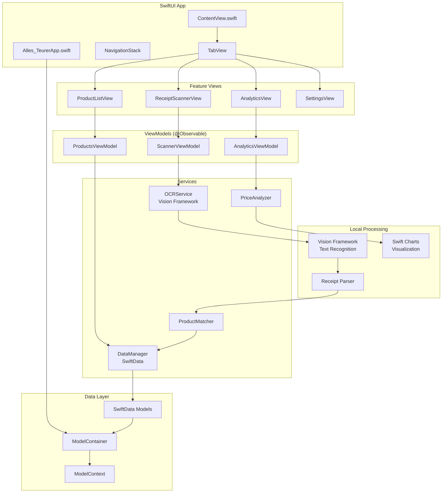

# AllesTeurer - Native iOS System Architecture

## 1. Executive Summary

AllesTeurer is a privacy-focused native iOS application that helps users track product prices through local receipt scanning and price analysis. The system uses SwiftUI for the user interface, SwiftData for local data persistence, Apple's Vision Framework for OCR text recognition, and Swift Charts for data visualization, ensuring all data remains under user control while providing powerful analytics and insights.

### Key Architectural Principles

- **Privacy-First**: All data processing happens on-device using native iOS frameworks
- **Local-First**: Full functionality without internet connectivity using SwiftData
- **iOS-Native**: Single platform focus with deep iOS integration and optimization
- **Accessibility**: WCAG 2.2 Level AA compliant using SwiftUI accessibility APIs
- **Performance**: Native performance leveraging iOS system frameworks
- **Extensible**: Clean architecture supporting future CloudKit integration

## 2. Native iOS Architecture Overview

### 2.1 SwiftUI Architecture



### 2.2 Core Components

#### 2.2.1 SwiftData Persistence Layer

- **Local Storage**: SwiftData for type-safe, native iOS data persistence
- **Data Models**: Swift structs and classes with `@Model` macro
- **Privacy**: All data stays on device with Core Data backend
- **Schema Evolution**: Automatic and manual migration support
- **CloudKit Integration**: Optional private cloud sync

#### 2.2.2 Vision Framework OCR Layer

- **iOS OCR Engine**: Vision Framework for receipt text extraction
- **iOS OCR Engine**: Vision Framework for precise German text recognition
- **Image Processing**: Core Image for receipt enhancement and preprocessing
- **Local Analytics**: Swift algorithms for price trend analysis and inflation calculations

#### 2.2.3 SwiftUI Presentation Layer

- **Declarative UI**: SwiftUI for modern, reactive user interfaces
- **Native Performance**: Compiled Swift code with optimized rendering
- **Accessibility**: Built-in VoiceOver and Dynamic Type support
- **Platform Integration**: Native iOS patterns and behaviors

## 3. Native iOS Technology Stack

### 3.1 Core iOS Technologies

- **Language**: Swift 5.9+ with modern async/await patterns
- **UI Framework**: SwiftUI with Observation framework
- **Architecture**: MVVM with Repository pattern
- **Concurrency**: Swift Concurrency (async/await, actors)
- **Storage**: SwiftData with Core Data backend
- **Charts**: Swift Charts for native data visualization

### 3.2 iOS System Integrations

#### Vision Framework Integration

- **OCR**: VNRecognizeTextRequest for receipt text extraction
- **Language Support**: German language optimization
- **Image Processing**: VNImageRequestHandler for preprocessing
- **Error Handling**: Confidence scoring and correction workflows

#### SwiftData Integration

- **Models**: @Model macro for automatic Core Data mapping
- **Queries**: @Query property wrapper for reactive data
- **Relationships**: Automatic relationship handling
- **Migration**: Schema versioning and data migration

### 3.3 Development Tools

- **IDE**: Xcode 15.0+ with Swift Package Manager
- **Build System**: Xcode Build System with Swift Package integration
- **CI/CD**: GitHub Actions with xcodebuild
- **Testing**: Swift Testing framework + XCUITest
- **Performance**: Instruments profiling for optimization

## 6. Privacy & Security Architecture

### 6.1 Privacy-First Design

- **Local Processing**: All OCR and analytics happen on-device using iOS frameworks
- **No User Tracking**: Zero third-party analytics or tracking
- **Data Ownership**: User controls all data with complete export capability
- **Minimal Permissions**: Only camera access required for receipt scanning
- **Transparent Storage**: Users can see and export all data via SwiftData

### 6.2 Data Security

- **SwiftData Encryption**: Core Data encryption at rest with iOS security
- **CloudKit Security**: End-to-end encryption for optional private sync
- **Keychain Services**: Sensitive settings stored in iOS Keychain
- **App Sandbox**: iOS app sandboxing for data isolation
- **Code Signing**: App Store security validation and notarization

### 6.3 GDPR Compliance

- **Data Minimization**: Only collect necessary receipt data for price tracking
- **Right to Export**: Built-in data export to CSV/JSON
- **Right to Delete**: Complete data deletion with SwiftData cascade deletes
- **Transparency**: Clear privacy policy and in-app data usage disclosure
- **Consent**: Optional CloudKit sync requires explicit user consent

## 7. Performance Optimization

### 7.1 OCR Performance

```swift
class OCROptimizer {
    func preprocessImage(_ image: UIImage) async -> UIImage? {
        // Optimize image for Vision Framework processing
        let targetSize = CGSize(width: 1024, height: 1024)

        return await withCheckedContinuation { continuation in
            DispatchQueue.global(qos: .userInitiated).async {
                let optimized = image
                    .resized(to: targetSize)
                    .enhanced(contrast: 1.2, brightness: 0.1)
                    .sharpened()
                continuation.resume(returning: optimized)
            }
        }
    }

    func performBatchOCR(_ images: [UIImage]) async -> [ReceiptData] {
        // Process multiple receipts efficiently with Swift Concurrency
        return await withTaskGroup(of: ReceiptData?.self, returning: [ReceiptData].self) { group in
            for image in images {
                group.addTask {
                    await self.processReceipt(image)
                }
            }

            var results: [ReceiptData] = []
            for await result in group {
                if let receiptData = result {
                    results.append(receiptData)
                }
            }
            return results
        }
    }
                results.append(result)
            }
            return results
        }
    }
}
```

### 7.2 Core Data Performance

```swift
extension DataManager {
    func fetchProductsEfficiently(limit: Int = 20) -> [Product] {
        let request: NSFetchRequest<Product> = Product.fetchRequest()
        request.fetchLimit = limit
        request.sortDescriptors = [NSSortDescriptor(key: "name", ascending: true)]
        request.relationshipKeyPathsForPrefetching = ["priceRecords"]

        return (try? persistentContainer.viewContext.fetch(request)) ?? []
    }

    func batchInsertReceipts(_ receipts: [ReceiptData]) async {
        await persistentContainer.performBackgroundTask { context in
            receipts.forEach { receiptData in
                let receipt = Receipt(context: context)
                // Set receipt properties
            }

            try? context.save()
        }
    }
}
```

### 7.3 Memory Management

- **Image Caching**: Smart caching for receipt images
- **Lazy Loading**: Load data on-demand
- **Background Processing**: Heavy operations off main thread
- **Memory Warnings**: Handle low memory situations
- **Resource Cleanup**: Proper cleanup of Vision requests

## 8. Future Backend Integration

### 8.1 Network Layer Preparation

```swift
// Prepared for future backend integration
protocol NetworkServiceProtocol {
    func syncReceipts() async throws -> [Receipt]
    func uploadReceipt(_ receipt: Receipt) async throws
    func downloadPriceData() async throws -> [PriceData]
}

class LocalNetworkService: NetworkServiceProtocol {
    // Current: Local-only implementation
    func syncReceipts() async throws -> [Receipt] {
        return DataManager.shared.fetchReceipts()
    }

    func uploadReceipt(_ receipt: Receipt) async throws {
        // No-op for local-only mode
    }

    func downloadPriceData() async throws -> [PriceData] {
        return [] // No external data yet
    }
}

class RemoteNetworkService: NetworkServiceProtocol {
    // Future: Backend integration
    func syncReceipts() async throws -> [Receipt] {
        // API calls to backend
    }
}
```

### 8.2 Migration Strategy

When adding backend services:

1. **Add Network Layer**: Implement API client alongside local services
2. **Hybrid Mode**: Local-first with optional cloud features
3. **Gradual Migration**: Users opt-in to cloud features
4. **Data Sync**: Bidirectional sync with conflict resolution
5. **Offline Support**: Full functionality without internet

## 9. Testing Architecture

### 9.1 Unit Testing Strategy

```swift
// Test OCR Service
class OCRServiceTests: XCTestCase {
    var ocrService: OCRService!

    override func setUp() {
        super.setUp()
        ocrService = OCRService()
    }

    func testReceiptProcessing() async throws {
        let testImage = UIImage(named: "test_receipt")!
        let result = try await ocrService.processReceipt(testImage)

        XCTAssertFalse(result.items.isEmpty)
        XCTAssertNotNil(result.storeName)
        XCTAssertGreaterThan(result.totalAmount, 0)
    }
}

// Test Data Manager
class DataManagerTests: XCTestCase {
    var dataManager: DataManager!

    override func setUp() {
        super.setUp()
        // Use in-memory Core Data for testing
        dataManager = DataManager(inMemory: true)
    }

    func testProductCreation() {
        let product = dataManager.createProduct(name: "Test Product")

        XCTAssertNotNil(product.id)
        XCTAssertEqual(product.name, "Test Product")
    }
}
```

### 9.2 UI Testing Strategy

```swift
class AppUITests: XCTestCase {
    var app: XCUIApplication!

    override func setUp() {
        super.setUp()
        app = XCUIApplication()
        app.launch()
    }

    func testReceiptScanningFlow() {
        // Test main tab navigation
        app.tabBars.buttons["Scan"].tap()

        // Test camera permission (if needed)
        let cameraButton = app.buttons["Scan Receipt"]
        XCTAssertTrue(cameraButton.exists)

        // Test scan flow (with mock data in UI tests)
        cameraButton.tap()

        // Verify results screen
        XCTAssertTrue(app.navigationBars["Scan Results"].exists)
    }

    func testAnalyticsView() {
        app.tabBars.buttons["Analytics"].tap()

        // Test chart visibility
        XCTAssertTrue(app.otherElements["Price History Chart"].exists)

        // Test data interaction
        let spendingCard = app.buttons["Monthly Spending"]
        XCTAssertTrue(spendingCard.exists)
    }
}
```

## 10. Deployment Architecture

### 10.1 App Store Configuration

- **Bundle Identifier**: eu.mpwg.allesteuer
- **Version Strategy**: Semantic versioning (1.0.0)
- **Capabilities**:
  - CloudKit
  - Camera usage
  - Background processing (for data sync)
- **Privacy Permissions**: Camera usage description
- **Target Audience**: 17+ (financial app)

### 10.2 CloudKit Configuration

```swift
// CloudKit container setup
extension CloudKitService {
    func configureContainer() {
        // Configure CloudKit schema
        let schema = CKSchema()

        // Receipt record type
        let receiptRecord = CKRecordType(name: "Receipt")
        receiptRecord.addField("storeName", type: .string)
        receiptRecord.addField("totalAmount", type: .double)
        receiptRecord.addField("purchaseDate", type: .dateTime)
        receiptRecord.addField("imageAsset", type: .asset)

        schema.add(receiptRecord)

        // Deploy schema to development and production
    }
}
```

### 10.3 CI/CD Pipeline

- **Development**: Automatic builds on feature branches
- **Testing**: Run unit and UI tests on pull requests
- **Beta Distribution**: TestFlight for internal testing
- **Production**: Automated App Store release process
- **Monitoring**: Crash reporting and performance metrics

## Conclusion

This Kotlin Multiplatform architecture provides:

- **Privacy-First**: All data processing happens locally on user's device
- **Cross-Platform Efficiency**: 85%+ code sharing between iOS and Android
- **Native Performance**: Direct compilation to platform-native code
- **Extensibility**: Clean architecture supporting future backend integration
- **Accessibility**: Full WCAG compliance with platform accessibility features
- **Security**: Platform-specific security with optional cloud sync encryption
- **User Experience**: Native platform patterns with shared business logic

The architecture is designed to deliver complete, functional apps that can launch simultaneously on both platforms while maintaining the flexibility to evolve into a full-stack solution as the product grows.
