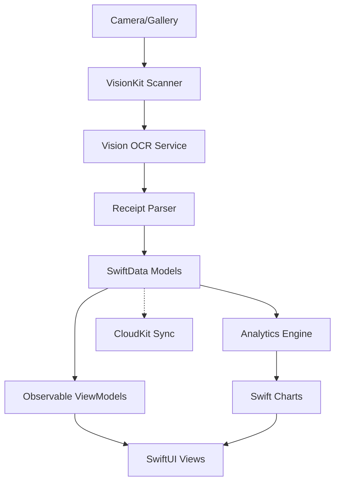

# AllesTeurer - Technical Architecture (iOS 26 Native)

## Architecture Overview

AllesTeurer is built as a native iOS 26 application using Swift 6's strict concurrency model, SwiftUI 6.0 for the user interface, and SwiftData 2.0 for persistence. The app leverages iOS 26's advanced Vision Framework for OCR and maintains a privacy-first, on-device processing approach.

## Platform Architecture

### Swift 6 Language Features

```swift
// Strict concurrency with complete data isolation
@MainActor
final class ReceiptViewModel: ObservableObject {
    // Automatically isolated to main actor
}

// Sendable conformance for thread-safe data
struct PriceData: Sendable {
    let price: Decimal
    let date: Date
}

// Actor isolation for data operations
actor DataProcessor {
    // Guaranteed thread-safe operations
}
```

### iOS 26 Platform Integration

- **Deployment Target**: iOS 26.0+, iPadOS 26.0+, Mac Catalyst 26.0+
- **Swift Version**: Swift 6.0 with strict concurrency checking
- **Xcode Version**: Xcode 16.0+
- **Architecture**: Universal Binary (ARM64)

## Core Components

### 1. Data Layer (SwiftData 2.0)

SwiftData 2.0 provides type-safe, declarative data persistence with automatic CloudKit sync:

```swift
@Model
final class Receipt {
    @Attribute(.unique) let id: UUID
    var storeName: String
    var items: [ReceiptItem]
    var totalAmount: Decimal

    @Relationship(deleteRule: .cascade)
    var priceRecords: [PriceRecord]
}

// Model Container Configuration
let container = try ModelContainer(
    for: Receipt.self, Product.self, Store.self,
    configurations: ModelConfiguration(
        isStoredInMemoryOnly: false,
        allowsSave: true,
        cloudKitDatabase: .automatic // iOS 26 automatic sync
    )
)
```

### 2. OCR Service (Vision Framework 4.0)

iOS 26's Vision Framework with enhanced multilingual support:

```swift
@available(iOS 26.0, *)
class VisionOCRService {
    private let textRequest = VNRecognizeTextRequest()

    init() {
        textRequest.recognitionLevel = .accurate
        textRequest.recognitionLanguages = ["de-DE"] // German priority
        textRequest.usesLanguageCorrection = true
        textRequest.automaticallyDetectsLanguage = true // iOS 26 feature
    }

    func processReceipt(_ image: UIImage) async throws -> StructuredReceipt {
        // iOS 26 structured data extraction
        let structuredRequest = VNRecognizeStructuredDocumentRequest()
        structuredRequest.documentType = .receipt // New in iOS 26

        // Returns pre-parsed receipt data
        let results = try await performRequest(structuredRequest, on: image)
        return StructuredReceipt(from: results)
    }
}
```

### 3. User Interface (SwiftUI 6.0)

Modern SwiftUI with Observable macro and enhanced navigation:

```swift
@Observable
@MainActor
final class AppModel {
    var selectedReceipt: Receipt?
    var navigationPath = NavigationPath()
    var scannerPresented = false

    func navigateToReceipt(_ receipt: Receipt) {
        selectedReceipt = receipt
        navigationPath.append(receipt)
    }
}

struct ContentView: View {
    @Environment(AppModel.self) private var model
    @Environment(\.horizontalSizeClass) private var sizeClass

    var body: some View {
        AdaptiveNavigation(sizeClass: sizeClass) {
            // Automatically adapts between NavigationStack and NavigationSplitView
        }
    }
}
```

### 4. Analytics Engine (Swift Charts 2.0)

Native charting with 3D visualizations:

```swift
struct InflationChart: View {
    let data: [PricePoint]

    var body: some View {
        Chart3D(data) { point in
            BarMark3D(
                x: .value("Date", point.date),
                y: .value("Price", point.price),
                z: .value("Store", point.store),
                width: .automatic,
                depth: .automatic
            )
            .foregroundStyle(.linearGradient(
                colors: [.blue, .red],
                startPoint: .bottom,
                endPoint: .top
            ))
        }
        .chart3DStyle(.realistic)
        .chartInteractivity(.all) // Gesture navigation
    }
}
```

## System Architecture Patterns

### MVVM with Observation

```swift
// Model
@Model
final class Product: Identifiable {
    let id: UUID
    var name: String
    var prices: [PriceRecord]
}

// ViewModel with Observation
@Observable
@MainActor
final class ProductViewModel {
    private let repository: ProductRepository
    var products: [Product] = []
    var isLoading = false

    func loadProducts() async {
        isLoading = true
        products = await repository.fetchAll()
        isLoading = false
    }
}

// View
struct ProductListView: View {
    @State private var viewModel = ProductViewModel()

    var body: some View {
        List(viewModel.products) { product in
            ProductRow(product: product)
        }
        .task {
            await viewModel.loadProducts()
        }
    }
}
```

### Actor-based Data Processing

```swift
@ModelActor
actor ReceiptProcessor {
    func processScannedReceipt(_ imageData: Data) async throws -> Receipt {
        // Thread-safe processing with automatic isolation
        let ocrResult = try await OCRService.shared.process(imageData)
        let receipt = Receipt(from: ocrResult)

        // SwiftData operations are automatically thread-safe
        modelContext.insert(receipt)
        try modelContext.save()

        return receipt
    }
}
```

## Platform-Specific Features

### iPhone

- Compact layouts with gesture navigation
- Camera-based receipt scanning
- Live Activities for shopping sessions
- Control Center quick actions

### iPad

- Multi-column layouts with NavigationSplitView
- Drag & drop receipt import
- Apple Pencil markup support
- Stage Manager multi-window

### Mac Catalyst

- Native menu bar with keyboard shortcuts
- File-based import/export
- AppleScript automation support
- Touch Bar integration

## Data Flow Architecture



## Performance Optimizations

### Swift 6 Concurrency

- **Structured Concurrency**: All async operations use Swift's structured concurrency
- **Actor Isolation**: Data operations isolated to prevent race conditions
- **MainActor**: UI updates automatically dispatched to main thread
- **Task Groups**: Parallel processing for batch operations

### Memory Management

- **Lazy Loading**: SwiftData relationships loaded on demand
- **Image Caching**: Processed receipt images cached with automatic eviction
- **Background Processing**: Heavy operations moved to background actors

## Security & Privacy

### On-Device Processing

- All OCR processing happens locally using Vision Framework
- No external API calls for core functionality
- Optional CloudKit sync with end-to-end encryption
- Privacy manifest declaring all data usage

### Data Protection

```swift
// Automatic encryption with SwiftData
let configuration = ModelConfiguration(
    url: containerURL,
    cloudKitDatabase: .private(DatabaseScope.privateCloudDatabase),
    fileProtection: .completeUnlessOpen // iOS 26 encryption
)
```

## Testing Architecture

### Swift Testing Framework

```swift
@Suite("OCR Processing", .serialized)
struct OCRTests {
    @Test("Receipt parsing accuracy",
          arguments: TestData.germanReceipts)
    func testReceiptParsing(testImage: UIImage) async throws {
        let result = try await OCRService.shared.process(testImage)
        #expect(result.accuracy > 0.95)
    }
}
```

### UI Testing with XCUITest

```swift
final class ReceiptScanningUITests: XCTestCase {
    @MainActor
    func testCompleteReceiptFlow() async throws {
        let app = XCUIApplication()
        app.launch()

        // Test with iOS 26 UI testing improvements
        try await app.scanReceipt()
        #expect(app.receipts.count == 1)
    }
}
```

## Deployment Architecture

### App Store Distribution

- **Universal Purchase**: Single purchase for iPhone, iPad, Mac
- **TestFlight**: Beta testing across all platforms
- **App Clips**: Quick receipt scanning without full app
- **Widgets**: Home Screen and Lock Screen widgets

### Configuration

```xml
<!-- Info.plist iOS 26 Configuration -->
<key>LSMinimumSystemVersion</key>
<string>26.0</string>
<key>UIRequiredDeviceCapabilities</key>
<array>
    <string>arm64</string>
</array>
<key>NSCameraUsageDescription</key>
<string>Camera access is required to scan receipts</string>
```
