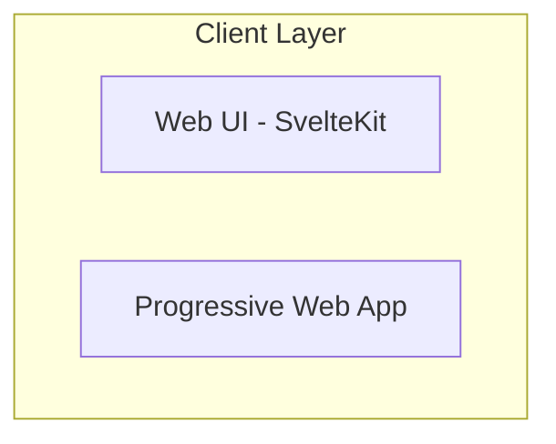
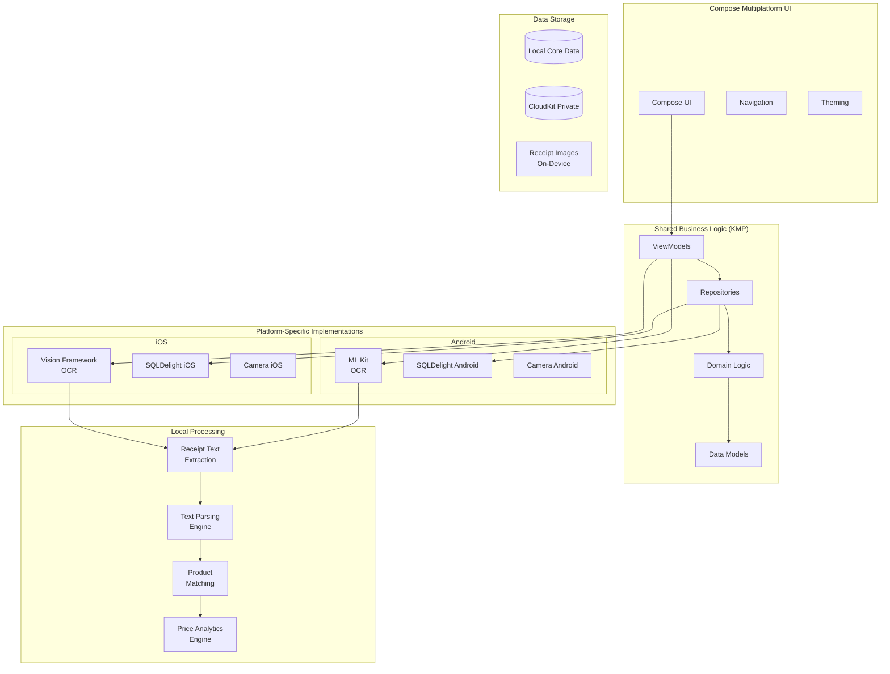

# AllesTeurer - Kotlin Multiplatform System Architecture

## 1. Executive Summary

AllesTeurer is a privacy-focused multiplatform application that helps users track product prices through local receipt scanning and price analysis. The system uses Kotlin Multiplatform Mobile (KMM) with Compose Multiplatform for shared business logic and UI, platform-specific OCR implementations (Vision Framework for iOS, ML Kit for Android), and SQLDelight for local storage, ensuring all data remains under user control while providing powerful analytics and insights.

### Key Architectural Principles

- **Privacy-First**: All data processing happens on-device
- **Local-First**: Full functionality without internet connectivity
- **Multiplatform-Native**: Single codebase with platform-specific optimizations
- **Accessibility**: WCAG 2.2 Level AA compliant
- **Performance**: Native performance with zero-overhead abstractions
- **Extensible**: Clean architecture supporting future backend integration

## 2. System Architecture Overview

### 2.1 High-Level Architecture



## 2. System Architecture Overview

### 2.1 Kotlin Multiplatform Architecture



### 2.2 Core Components

#### 2.2.1 Shared Data Layer (SQLDelight)

- **Local Storage**: SQLDelight for type-safe, multiplatform SQL queries
- **Data Models**: Kotlin data classes with @Serializable annotations
- **Privacy**: All data stays on device, no cloud dependencies by default
- **Migrations**: Version-controlled schema evolution

#### 2.2.2 Platform-Specific Processing Layer

- **iOS OCR Engine**: Vision Framework for receipt text extraction
- **Android OCR Engine**: ML Kit for receipt text extraction
- **Image Processing**: Platform-specific receipt enhancement
- **Shared Analytics**: Kotlin algorithms for price trend analysis

#### 2.2.3 Compose Multiplatform UI Layer

- **Cross-Platform**: Single UI codebase for iOS and Android
- **Native Feel**: Platform-specific adaptations and theming
- **Accessibility**: Built-in accessibility support across platforms
- **Performance**: Native compilation with zero overhead

## 3. Kotlin Multiplatform Technology Stack

### 3.1 Core KMP Technologies

- **Language**: Kotlin 2.2.20+ with K2 compiler
- **UI Framework**: Compose Multiplatform
- **Architecture**: MVVM with Repository pattern
- **Concurrency**: Kotlin Coroutines + Flow
- **Storage**: SQLDelight
- **Serialization**: kotlinx.serialization

### 3.2 Platform-Specific Integrations

#### iOS

- **OCR**: Vision Framework via expect/actual
- **Camera**: AVFoundation via Compose integration
- **Local Storage**: SQLDelight with native SQLite driver
- **Navigation**: Native iOS navigation patterns

#### Android

- **OCR**: ML Kit via expect/actual declarations
- **Camera**: CameraX via Compose integration
- **Local Storage**: SQLDelight with Android SQLite
- **Navigation**: Compose Navigation

### 3.3 Development Tools

- **IDE**: IntelliJ IDEA / Android Studio
- **Build**: Gradle 9+ with Kotlin DSL
- **CI/CD**: GitHub Actions with KMP
- **Testing**: Kotlin Test + Compose UI Testing
- **Performance**: Profiler plugins for each platform

## 6. Privacy & Security Architecture

### 6.1 Privacy-First Design

- **Local Processing**: All OCR and analytics happen on-device
- **No User Tracking**: Zero third-party analytics or tracking
- **Data Ownership**: User controls all data export/import
- **Minimal Permissions**: Only camera access required
- **Transparent Storage**: Users can see and export all data via SQLDelight

### 6.2 Data Security

- **SQLDelight Encryption**: Database encryption at rest
- **CloudKit Security**: End-to-end encryption for sync
- **Secure Keychain**: Sensitive settings stored securely
- **App Sandbox**: iOS app sandboxing for security
- **Code Signing**: App Store security validation

### 6.3 GDPR Compliance

- **Data Minimization**: Only collect necessary receipt data
- **Right to Export**: Built-in data export functionality
- **Right to Delete**: Complete data deletion option
- **Transparency**: Clear privacy policy and data usage
- **Consent**: Optional CloudKit sync requires user consent

## 7. Performance Optimization

### 7.1 OCR Performance

```swift
class OCROptimizer {
    func preprocessImage(_ image: UIImage) -> UIImage? {
        // Optimize image for OCR processing
        let targetSize = CGSize(width: 1024, height: 1024)

        return image
            .resized(to: targetSize)
            .enhanced(contrast: 1.2, brightness: 0.1)
            .sharpened()
    }

    func performBatchOCR(_ images: [UIImage]) async -> [ReceiptData] {
        // Process multiple receipts efficiently
        let tasks = images.map { image in
            Task { await processReceipt(image) }
        }

        return await withTaskGroup(of: ReceiptData.self) { group in
            for task in tasks {
                group.addTask { await task.value }
            }

            var results: [ReceiptData] = []
            for await result in group {
                results.append(result)
            }
            return results
        }
    }
}
```

### 7.2 Core Data Performance

```swift
extension DataManager {
    func fetchProductsEfficiently(limit: Int = 20) -> [Product] {
        let request: NSFetchRequest<Product> = Product.fetchRequest()
        request.fetchLimit = limit
        request.sortDescriptors = [NSSortDescriptor(key: "name", ascending: true)]
        request.relationshipKeyPathsForPrefetching = ["priceRecords"]

        return (try? persistentContainer.viewContext.fetch(request)) ?? []
    }

    func batchInsertReceipts(_ receipts: [ReceiptData]) async {
        await persistentContainer.performBackgroundTask { context in
            receipts.forEach { receiptData in
                let receipt = Receipt(context: context)
                // Set receipt properties
            }

            try? context.save()
        }
    }
}
```

### 7.3 Memory Management

- **Image Caching**: Smart caching for receipt images
- **Lazy Loading**: Load data on-demand
- **Background Processing**: Heavy operations off main thread
- **Memory Warnings**: Handle low memory situations
- **Resource Cleanup**: Proper cleanup of Vision requests

## 8. Future Backend Integration

### 8.1 Network Layer Preparation

```swift
// Prepared for future backend integration
protocol NetworkServiceProtocol {
    func syncReceipts() async throws -> [Receipt]
    func uploadReceipt(_ receipt: Receipt) async throws
    func downloadPriceData() async throws -> [PriceData]
}

class LocalNetworkService: NetworkServiceProtocol {
    // Current: Local-only implementation
    func syncReceipts() async throws -> [Receipt] {
        return DataManager.shared.fetchReceipts()
    }

    func uploadReceipt(_ receipt: Receipt) async throws {
        // No-op for local-only mode
    }

    func downloadPriceData() async throws -> [PriceData] {
        return [] // No external data yet
    }
}

class RemoteNetworkService: NetworkServiceProtocol {
    // Future: Backend integration
    func syncReceipts() async throws -> [Receipt] {
        // API calls to backend
    }
}
```

### 8.2 Migration Strategy

When adding backend services:

1. **Add Network Layer**: Implement API client alongside local services
2. **Hybrid Mode**: Local-first with optional cloud features
3. **Gradual Migration**: Users opt-in to cloud features
4. **Data Sync**: Bidirectional sync with conflict resolution
5. **Offline Support**: Full functionality without internet

## 9. Testing Architecture

### 9.1 Unit Testing Strategy

```swift
// Test OCR Service
class OCRServiceTests: XCTestCase {
    var ocrService: OCRService!

    override func setUp() {
        super.setUp()
        ocrService = OCRService()
    }

    func testReceiptProcessing() async throws {
        let testImage = UIImage(named: "test_receipt")!
        let result = try await ocrService.processReceipt(testImage)

        XCTAssertFalse(result.items.isEmpty)
        XCTAssertNotNil(result.storeName)
        XCTAssertGreaterThan(result.totalAmount, 0)
    }
}

// Test Data Manager
class DataManagerTests: XCTestCase {
    var dataManager: DataManager!

    override func setUp() {
        super.setUp()
        // Use in-memory Core Data for testing
        dataManager = DataManager(inMemory: true)
    }

    func testProductCreation() {
        let product = dataManager.createProduct(name: "Test Product")

        XCTAssertNotNil(product.id)
        XCTAssertEqual(product.name, "Test Product")
    }
}
```

### 9.2 UI Testing Strategy

```swift
class AppUITests: XCTestCase {
    var app: XCUIApplication!

    override func setUp() {
        super.setUp()
        app = XCUIApplication()
        app.launch()
    }

    func testReceiptScanningFlow() {
        // Test main tab navigation
        app.tabBars.buttons["Scan"].tap()

        // Test camera permission (if needed)
        let cameraButton = app.buttons["Scan Receipt"]
        XCTAssertTrue(cameraButton.exists)

        // Test scan flow (with mock data in UI tests)
        cameraButton.tap()

        // Verify results screen
        XCTAssertTrue(app.navigationBars["Scan Results"].exists)
    }

    func testAnalyticsView() {
        app.tabBars.buttons["Analytics"].tap()

        // Test chart visibility
        XCTAssertTrue(app.otherElements["Price History Chart"].exists)

        // Test data interaction
        let spendingCard = app.buttons["Monthly Spending"]
        XCTAssertTrue(spendingCard.exists)
    }
}
```

## 10. Deployment Architecture

### 10.1 App Store Configuration

- **Bundle Identifier**: eu.mpwg.allesteuer
- **Version Strategy**: Semantic versioning (1.0.0)
- **Capabilities**:
  - CloudKit
  - Camera usage
  - Background processing (for data sync)
- **Privacy Permissions**: Camera usage description
- **Target Audience**: 17+ (financial app)

### 10.2 CloudKit Configuration

```swift
// CloudKit container setup
extension CloudKitService {
    func configureContainer() {
        // Configure CloudKit schema
        let schema = CKSchema()

        // Receipt record type
        let receiptRecord = CKRecordType(name: "Receipt")
        receiptRecord.addField("storeName", type: .string)
        receiptRecord.addField("totalAmount", type: .double)
        receiptRecord.addField("purchaseDate", type: .dateTime)
        receiptRecord.addField("imageAsset", type: .asset)

        schema.add(receiptRecord)

        // Deploy schema to development and production
    }
}
```

### 10.3 CI/CD Pipeline

- **Development**: Automatic builds on feature branches
- **Testing**: Run unit and UI tests on pull requests
- **Beta Distribution**: TestFlight for internal testing
- **Production**: Automated App Store release process
- **Monitoring**: Crash reporting and performance metrics

## Conclusion

This Kotlin Multiplatform architecture provides:

- **Privacy-First**: All data processing happens locally on user's device
- **Cross-Platform Efficiency**: 85%+ code sharing between iOS and Android
- **Native Performance**: Direct compilation to platform-native code
- **Extensibility**: Clean architecture supporting future backend integration
- **Accessibility**: Full WCAG compliance with platform accessibility features
- **Security**: Platform-specific security with optional cloud sync encryption
- **User Experience**: Native platform patterns with shared business logic

The architecture is designed to deliver complete, functional apps that can launch simultaneously on both platforms while maintaining the flexibility to evolve into a full-stack solution as the product grows.
