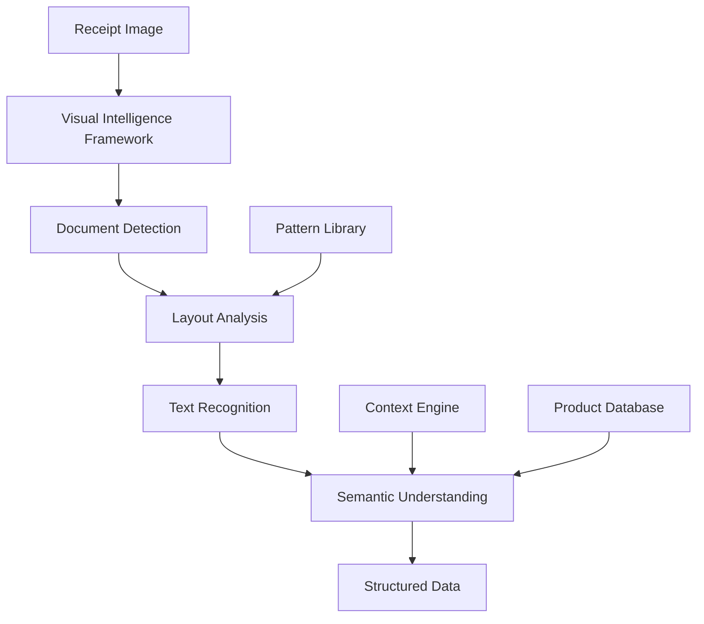

# AllesTeurer - Visual Intelligence Architecture Specification

## Executive Summary

AllesTeurer leverages Apple's Visual Intelligence framework to create a universal receipt scanning system that adapts to any store format without hard-coded implementations. The system uses advanced machine learning models to understand receipt structures dynamically, ensuring privacy-first processing entirely on-device.

## Core Architecture Principles

### 1. Universal Receipt Understanding

- **No Store-Specific Code**: The system adapts to any receipt format automatically
- **Context-Aware Processing**: Visual Intelligence understands receipt context and structure
- **Self-Learning**: Improves accuracy over time through on-device learning
- **Multi-Format Support**: Handles printed, digital, handwritten receipts

### 2. Privacy-First Design

- **100% On-Device Processing**: No data leaves the device for scanning
- **Local ML Models**: All Visual Intelligence models run locally
- **User-Controlled Data**: Complete user ownership of all receipt data
- **Optional Sync**: CloudKit sync only when explicitly enabled

## System Architecture

### Layer 1: Visual Intelligence Core

```swift
actor VisualIntelligenceProcessor {
    private let analyzer = VIDocumentAnalyzer()
    private let contextEngine = VIContextualUnderstanding()

    func processReceipt(_ image: UIImage) async throws -> UniversalReceipt {
        // Stage 1: Document Analysis
        let documentType = try await analyzer.detectDocumentType(image)
        guard documentType == .receipt else {
            throw VIError.notAReceipt
        }

        // Stage 2: Structural Understanding
        let structure = try await analyzer.analyzeDocumentStructure(image)

        // Stage 3: Content Extraction
        let content = try await extractContent(from: image, using: structure)

        // Stage 4: Semantic Understanding
        let semantics = try await contextEngine.understand(content)

        // Stage 5: Data Structuring
        return UniversalReceipt(from: semantics)
    }
}
```

### Layer 2: Adaptive Data Models

```swift
@Model
final class UniversalReceipt {
    let id: UUID
    let scanDate: Date

    // Dynamic store information
    var storeInfo: StoreInformation

    // Flexible item structure
    var items: [UniversalItem]

    // Computed totals
    var totals: ReceiptTotals

    // Metadata
    var metadata: ReceiptMetadata
}

struct UniversalItem: Codable, Sendable {
    let identifier: String
    let descriptions: [String] // Multiple descriptions for matching
    let quantity: Decimal
    let unitPrice: Decimal?
    let totalPrice: Decimal
    let category: ItemCategory?
    let attributes: [String: Any] // Flexible attributes
}
```

### Layer 3: Intelligence Services

#### Pattern Recognition Service

```swift
actor PatternRecognitionService {
    func identifyReceiptPatterns(_ image: UIImage) async throws -> ReceiptPattern {
        // Identifies common receipt layouts
        // Adapts to new formats automatically
    }
}
```

#### Product Matching Service

```swift
actor ProductMatchingService {
    func matchProducts(from items: [UniversalItem]) async throws -> [MatchedProduct] {
        // Uses Natural Language Processing
        // Handles variations in product names
        // Creates product fingerprints
    }
}
```

#### Price Intelligence Service

```swift
actor PriceIntelligenceService {
    func analyzePriceChanges(for product: MatchedProduct) async -> PriceAnalysis {
        // Tracks price evolution
        // Calculates inflation metrics
        // Identifies pricing patterns
    }
}
```

## Visual Intelligence Integration

### Document Analysis Pipeline



### Key Visual Intelligence APIs

```swift
import Vision
import VisionKit

class VisionIntelligenceService {
    // Document Analysis Request
    private lazy var documentRequest: VNRecognizeDocumentRequest = {
        let request = VNRecognizeDocumentRequest { request, error in
            // Process document structure
        }
        request.recognitionLevel = .accurate
        request.usesLanguageCorrection = true
        request.recognitionLanguages = ["de-DE", "en-US"]
        request.customWords = self.loadCustomVocabulary()
        return request
    }()

    // Visual Intelligence Analysis
    private lazy var intelligenceRequest: VNAnalyzeImageRequest = {
        let request = VNAnalyzeImageRequest()
        request.configuration = [
            .documentUnderstanding,
            .textRecognition,
            .layoutAnalysis
        ]
        return request
    }()
}
```

## Adaptive Learning System

### On-Device Learning

```swift
actor LearningEngine {
    private var patterns: [ReceiptPattern] = []
    private var productMappings: [String: ProductIdentity] = []

    func learn(from receipt: UniversalReceipt) async {
        // Update pattern recognition
        await updatePatterns(receipt.metadata.layoutPattern)

        // Improve product matching
        await updateProductMappings(receipt.items)

        // Refine price models
        await updatePriceModels(receipt.items)
    }

    private func updatePatterns(_ pattern: LayoutPattern) async {
        // Adaptive pattern learning
    }
}
```

### Confidence Scoring

```swift
struct RecognitionConfidence {
    let overall: Double
    let storeIdentification: Double
    let itemRecognition: Double
    let priceExtraction: Double
    let totalValidation: Double

    var requiresUserReview: Bool {
        overall < 0.85 || totalValidation < 0.90
    }
}
```

## User Interaction Layer

### Smart Correction Interface

```swift
struct IntelligentCorrectionView: View {
    @State private var receipt: UniversalReceipt
    @State private var confidence: RecognitionConfidence

    var body: some View {
        ScrollView {
            if confidence.requiresUserReview {
                CorrectionSuggestionsView(
                    receipt: receipt,
                    lowConfidenceItems: receipt.itemsRequiringReview
                )
            }

            ReceiptPreviewView(receipt: receipt)
                .overlay(ConfidenceIndicator(confidence: confidence))
        }
    }
}
```

### Visual Feedback System

```swift
struct VisualIntelligenceFeedback: ViewModifier {
    let processingState: ProcessingState

    func body(content: Content) -> some View {
        content
            .overlay(
                Group {
                    switch processingState {
                    case .analyzing:
                        IntelligenceAnimationView()
                    case .identifying(let regions):
                        RegionHighlightView(regions: regions)
                    case .extracting(let progress):
                        ExtractionProgressView(progress: progress)
                    case .complete(let confidence):
                        SuccessIndicator(confidence: confidence)
                    }
                }
            )
    }
}
```

## Data Processing Pipeline

### Stage 1: Image Preprocessing

```swift
extension UIImage {
    func prepareForIntelligence() async -> UIImage {
        await withCheckedContinuation { continuation in
            Task {
                let processed = self
                    .normalizeOrientation()
                    .enhanceContrast()
                    .correctPerspective()
                    .optimizeForOCR()
                continuation.resume(returning: processed)
            }
        }
    }
}
```

### Stage 2: Intelligent Extraction

```swift
struct IntelligentExtractor {
    func extract(from image: UIImage) async throws -> RawReceiptData {
        // Multi-pass extraction strategy
        let firstPass = try await quickExtraction(image)

        if firstPass.confidence < 0.7 {
            let enhancedImage = await image.enhanceForLowConfidence()
            let secondPass = try await detailedExtraction(enhancedImage)
            return merge(firstPass, secondPass)
        }

        return firstPass
    }
}
```

### Stage 3: Semantic Understanding

```swift
actor SemanticProcessor {
    func process(_ raw: RawReceiptData) async throws -> SemanticReceipt {
        // Understand context
        let context = try await identifyContext(raw)

        // Map to semantic model
        let items = try await mapToSemanticItems(raw.lines, context: context)

        // Validate relationships
        try await validateSemantics(items)

        return SemanticReceipt(
            context: context,
            items: items,
            metadata: extractMetadata(raw)
        )
    }
}
```

## Error Handling & Recovery

### Intelligent Error Recovery

```swift
enum IntelligenceError: Error {
    case documentNotRecognized
    case lowConfidence(RecognitionConfidence)
    case partialExtraction(extracted: PartialReceipt, missing: [Field])
    case ambiguousTotal(candidates: [Decimal])
}

struct ErrorRecoveryStrategy {
    static func recover(from error: IntelligenceError) async -> RecoveryAction {
        switch error {
        case .lowConfidence(let confidence):
            return .requestUserVerification(confidence.lowConfidenceAreas)
        case .partialExtraction(let partial, let missing):
            return .attemptPartialSave(partial, requestingFields: missing)
        case .ambiguousTotal(let candidates):
            return .presentTotalOptions(candidates)
        default:
            return .requestManualEntry
        }
    }
}
```

## Performance Optimization

### Caching Strategy

```swift
actor IntelligenceCache {
    private var patternCache: [ImageFingerprint: ReceiptPattern] = [:]
    private var storeCache: [StoreFingerprint: StoreInfo] = [:]

    func getCachedPattern(for image: UIImage) async -> ReceiptPattern? {
        let fingerprint = await image.generateFingerprint()
        return patternCache[fingerprint]
    }
}
```

### Batch Processing

```swift
actor BatchProcessor {
    func processBatch(_ images: [UIImage]) async -> [UniversalReceipt] {
        await withTaskGroup(of: UniversalReceipt?.self) { group in
            for image in images {
                group.addTask {
                    try? await self.processReceipt(image)
                }
            }

            var receipts: [UniversalReceipt] = []
            for await receipt in group {
                if let receipt {
                    receipts.append(receipt)
                }
            }
            return receipts
        }
    }
}
```

## Security & Privacy

### Data Protection

```swift
extension UniversalReceipt {
    func encrypt() async throws -> EncryptedReceipt {
        let key = try await KeychainManager.shared.getOrCreateKey()
        let encryptedData = try await CryptoKit.seal(self, using: key)
        return EncryptedReceipt(data: encryptedData)
    }
}
```

### Privacy Controls

```swift
struct PrivacySettings {
    var allowOnDeviceLearning: Bool = true
    var shareAnonymizedPatterns: Bool = false
    var retainOriginalImages: Bool = false
    var autoDeleteAfterDays: Int = 90
}
```

## Testing Strategy

### Visual Intelligence Mocking

```swift
protocol VisualIntelligenceProtocol {
    func analyze(_ image: UIImage) async throws -> DocumentAnalysis
}

struct MockVisualIntelligence: VisualIntelligenceProtocol {
    func analyze(_ image: UIImage) async throws -> DocumentAnalysis {
        // Return test data
    }
}
```

### Confidence Testing

```swift
@Test("Receipt recognition confidence")
func testRecognitionConfidence() async {
    let testImage = TestData.blurryReceipt
    let result = try await processor.processReceipt(testImage)

    #expect(result.confidence.overall > 0.5)
    #expect(result.confidence.requiresUserReview == true)
}
```

## Migration Path

### From Store-Specific to Universal

1. **Phase 1**: Implement Visual Intelligence alongside existing code
2. **Phase 2**: Route new stores through Visual Intelligence
3. **Phase 3**: Migrate existing store handlers to universal system
4. **Phase 4**: Remove store-specific code

## Success Metrics

- **Recognition Accuracy**: >95% for standard receipts
- **Processing Time**: <2 seconds per receipt
- **User Corrections**: <5% require manual intervention
- **Store Coverage**: 100% of stores without specific code
- **Memory Usage**: <50MB during processing
